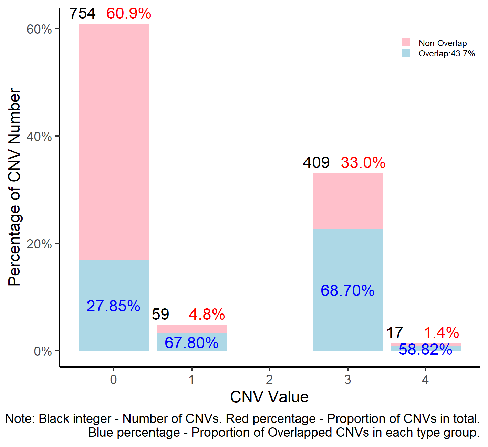

```{r, include = FALSE}
knitr::opts_chunk$set(
  collapse = TRUE,
  comment = "#>"
)
```

# Introduction
This package was originally designed for the Post-analysis of CNV results inferred from PennCNV and GenomeStudio. And now it was expanded to accept the standard format input file to use these functions. It's aimed to provide a Standard, Reproducible and Time-saving pipelines for the post-analysis of CNV and ROH. According to the purpose of functions it can be divide to four sectors: Conversion, Summarization, Comparison and Visualization. The most useful features are it could integrate summarize results, generate CNVR, annotated gene, plot CNVR distribution map and customize visualizing CNV and ROH with gene and other related information together. It support user to create a new folder to save results from each function, and set the title or adjust the size of final figures to meet the need of users. This package is suitable for the post-CNV analysis to not only Bovine (Cattle) but also Human and Swine (Pig) studies. As following, We will explain how to use these functions to solve the problems.

# Prerequisite
To use this package, you need to install R in your computer at first (https://www.r-project.org/).<br> Then install the 'HandyCNV' from Github repository, we assuming you have some experience with R language and already have  R or R Studio installed in your computer, now, let's install the package 'HandyCNV' from Github repository.
```{r}
#library(remotes)
#install_github(repo = "JH-Zhou/HandyCNV", auth_token = "3d2ac98e4c297bab332f1e68b3b2d49f3a17d6aa")
```
Then loading 'HandyCNV' to use it later.
```{r setup}
library(HandyCNV)
```
Start to use this package, the users at least need to prepare a CNV list. To use all of these functions, users need to prepare the map file, signal intensity file, pedigree, reference gene lists and a plink format bed, fam and map files. Don't afraid to prepare these files, some of those you already had and used in the CNV inferring progress. In order to get more valuable results, it worth to spend some time to lay the foundation, and then, you will found the rest of work are easier and will saving a lot of time. We will introduce how to prepare each input file during the following 'To what Issue' chunk while we using it.

# Demo data
We provide some internal demo data and it will installed with package together. We are going to use these data as an example to present how to use this package as following.<br> We can call the demo data by following code. The first cnv results is default file from PennCNV with ARS-UCD 1.2 (ARS) reference genome, the second cnv results is defaults output from CNVPartition with UMD 3.1 (UMD) reference genome. <br> Note: If you are dislike to work with this demo data, just skip this step to the section 1 and have fun with your own data.
```{r}
cnv_penn_ars <- system.file("extdata", "Demo_data/cnv_results/ARS_PennCNV_WGC.goodcnv", package = "HandyCNV")
cnv_part_umd <- system.file("extdata", "Demo_data/cnv_results/UMD_CNVPartition.txt", package = "HandyCNV")
```

# What Issues can this package solve?
As above we mentioned, the functions in the package are four sectors: Conversion, Summarization, Comparison and Visualization. Conversion part, could convert the map file between users provide the default and target maps, this is useful when you are detecting CNVs with two versions of reference genome, the converted maps file has the well-prepared formats can used in Plink, PennCNV and our package 'HandyCNV'. Another feature is it support to convert coordinates for intervals (CNV, CNVR, QTL et al) between the defaults and target maps, which might useful when the users want to compare the results with others. Summarization part including format and details summary of CNVs, generate CNVRs, plot CNVR distribution maps, auto-download reference gene lists and annotate genes for CNV and CNVR or other interval. Comparison section including comparison of CNVs, CNVRs, Gene Frequent Lists and any other Intervals, the highlights are comparison of CNVs and CNVRs support comparing results between different reference genome and reports details comparison results on both individual and population levels. Visualization segment contains functions to support users customize plotting CNVs on each Chromosome, specific Samples or any interested regions on each chromosome, and add more information on each plots (such as Signal Intensity, Pedigree, or Plink-format Genotyping files). Besides, its can plotting genes separately from reference gene lists which might useful when we want to combine with other plots.

#Setting up working directory
To start analysis, let's setup the working directory at first. Make sure all results are saving in the same directory.
```{r}
#setwd(dir = "C:/Users/handy_test") #remember to replace the path with your own 
```
Now we can start to explore the functions of 'HandyCNV'

## 1. How to prepare the standard cnv input file for 'HandyCNV' and got a fast summary?
We can use 'cnv_clean' function to convert cnv results to standard format. This function will also make a basic summaries of CNVs condition.<br> Let's formatting the cnv results from PennCNV at first. 
```{r cnv_clean_penn, echo=TRUE, warning=FALSE}
cnv_clean(penncnv = cnv_penn_ars) #when run your own data, set this argument by 'penncnv = "localpath/file"'
```

Then let's formatting the cnv results from CNVPartition. 
```{r cnv_clean_part, echo=TRUE, warning=FALSE}
cnv_clean(cnvpartition = cnv_part_umd) #when run your own data, set this argument by 'cnvpartition = "localpath/file"'
```
If your cnv results not from PennCNV or Partition, you need to arrange your CNV results in to the standard format.<br> The standard cnv input list should include column by order with:<br> 'Sample_ID', "Chr", "Start", "End", "CNV_Value" and "Length".

## 2 How to visualizing CNVs?
### 2.1 How to have a quick overview of all CNVs on each chromosome?
Once we got the standard clean_cnv result, we can use 'cnv_visual' function to plot all CNV on have a quick look the distribution of CNVs.<br>
Now, let's visualizing the whole CNVs for Penn results at first.
```{r fig.show='hide', warning=FALSE}
cnv_visual(clean_cnv = "clean_cnv/penncnv_clean.cnv", 
           max_chr = 29, 
           folder = "cnv_visual_all_penn")
```
{width=320px}

Let's now to visualize CNVs of Part results. We can adjust the size of final figure by setting 'width_1' and 'height_1'.
```{r fig.show='hide', message=FALSE, warning=FALSE}
cnv_visual(clean_cnv = "clean_cnv/cnvpart_clean.cnv", 
           max_chr = 29, 
           folder = "cnv_visual_all_part", 
           width_1 = 23, 
           height_1 = 13.5)
```
{width=320px}

### 2.2 How do we plotting an interested region?
After we plotted all CNVs on each chromosome, we might find some region are interested, we can customize it by 'cnv_visual' function.<br> Here we take chromosome 15 of Penn result as example.
```{r fig.show='hide', warning=FALSE}
cnv_visual(clean_cnv = "clean_cnv/penncnv_clean.cnv", 
           chr_id = 15, 
           start_position = 77, 
           end_position = 80,
           folder = "cnv_visual")
```
{width=320px}

### 2.3 How do we plotting all CNVs for an interested sample?
Here we just need assign the Sample ID to 'individual_id' and CNV list to 'clean_cnv' in 'cnv_visual' function, then the individual CNV plot will saved in working directory. In the example, the sample "201094560076_R03C02" has the most CNVs in Penn results, let's try to plot it have a look. <br> Note: The 'individual_cnv_count.txt' file will generate at sector 3 when making summary plots, we can choose the interested individual in that file.
```{r fig.show='hide', warning=FALSE}
cnv_visual(clean_cnv = "clean_cnv/penncnv_clean.cnv", 
           individual_id = "201094560076_R03C02",
           folder = "cnv_visual")
```
{width=320px}

## 3. After we formating the CNV results, how to make some summarises figure?
Now we need the formatted clean_cnv.cnv file to use cnv_summary_plot function.<br> First, let's plotting for Part_cnv result.
```{r cnv_summary_plot_penn, fig.show='hide', warning=FALSE}
cnv_summary_plot(clean_cnv = "clean_cnv/cnvpart_clean.cnv")
```
{width=300px}

Second, let's plotting for Penn_CNV results. As we see the remind messages, we could make some integrate plots by cnv_summary_plot.<br> Let's add these two arguments to see what the results looks like? We can set the folder name by 'folder' argument to avoid the results replacing previous one.
```{r cnv_summary_plot_part, fig.show='hide', warning=FALSE}
cnv_summary_plot(clean_cnv = "clean_cnv/penncnv_clean.cnv", 
                 plot_sum_1 = "yes", 
                 plot_sum_2 = "yes", 
                 folder = "cnv_summary_plot_Penn")
```
{width=300px}

## 4. How to generate the CNVR (CNV Region)?
The input file is the standard cnv results save in 'clean_cnv' directory.<br> Let's generate CNVR for Penn CNV results at first. Attention at here, in call_cnvr function support Users to set the maximum number of chromosome to generate CNVRs. In our example, the species is Bovine, so we set 'chr_set' as '29'. This function will report three tables, one is CNVR list, one of a brief summary table about the length, number of CNVR under type of Deletion, Duplication and Mixed, and another is total length and number of CNVR on each chromosome. 
```{r echo=TRUE, warning=FALSE}
call_cnvr(clean_cnv = "clean_cnv/penncnv_clean.cnv", 
          chr_set = 29, 
          folder = "Penn")
```

Secondly, let's generate CNVRs for Part CNV results. In order to avoid mixing the results among different files, we can set 'folder' arguments to assign a distinguish name of new generated folder. 
```{r warning=FALSE}
call_cnvr(clean_cnv = "clean_cnv/cnvpart_clean.cnv", 
          chr_set = '29', 
          folder = "Part")
```

## 5. How to annotated genes for CNVR and CNV?
Once we got cnv and cnvr results, we might want to see how many genes located in these structure variation region? We can annotated gene to CNV and CNVR by 'call_gene' function. But we need to prepare the right reference gene lists before we calling genes. Now we have a problem, how do we get the reference genes? Let's move to next heading to see the solution. 

### 5.1 How can we get the reference genome we need?
Here we have a function 'get_refgene' could automatically download the reference gene and convert the it to standard format. Let's see which version of reference gene we can download. To see the support information only need to run 'get_refgene' without any argument.
```{r}
get_refgene()
```

Let's get the reference gene for Penn result at first, note here Penn result are using ARS-UCD 1.2 as reference. From above check information, We can choose "cow_ARS_UCSC" or "cow_ARS_ENS" to download, 'ENS' indicate to Ensembl reference gene. The output will saving in 'refgene' folder.
```{r}
get_refgene(gene_version = "cow_ARS_UCSC")
```
We can also download the ARS-UCD 1.2 with Ensembl reference gene, let's try it.
```{r}
get_refgene(gene_version = "cow_ARS_ENS")
```

Then let's get reference gene for Part CNV result, the version of genome is UMD 3.1, we need to pay attention to select the correct version arguments.
```{r}
get_refgene(gene_version = "cow_UMD_UCSC")
```

Now we have well-prepared the reference gene, let's moving to next step to 'call_gene'

### 5.2 How to annotate genes for CNV and CNVR?
For Bovine data, we have three reference gene lists were embed into 'HandyCNV', including ARS version of Ensemble and UCSC reference gene and one UMD UCSC version, we will update these reference gene lists every four months. For the User who are analyzing Bovine data could use argument 'ref_gene = "ARS_ens"', 'ref_gene = "ARS_UCSC"' or 'ref_gene = "UMD_UCSC"' to call corresponding genes. For the Users who studying the other species, could provide the gene lists by yourself with given the path of your reference gene-list with 'ref_gene' argument to call genes. The reference gene lists could download from UCSC website for most of Species, they should have a fixed format, please see the standard input file format.<br> 

Note:In 'call_gene' function, there are three arguments, 'ref_gene' is essential, but 'interval' and 'clean_cnv' you can choose one of them or select all. We suggest to set both 'interval' and 'clean_cnv' simultaneously, then it will count and report the gene frequency which by counting how many CNVs overlapped to a gene within a CNVR. The term of 'interval' may confuse you, we call it as this because it not limited on CNVR list, it could be a CNV, QTL, Haplowtype list or any other interval list with standard input format.<br> Now let's going to call genes for these structure variations.<br> 

First, we calling gene for Penn results, need to pay attention to here the results is the ARS version, we need to choose the right reference gene list.
```{r}
call_gene(refgene = "refgene/cow_ARS_ENS.txt", 
          interval = "call_cnvr_Penn/cnvr.txt", 
          clean_cnv = "clean_cnv/penncnv_clean.cnv", 
          folder = "Penn_Ens")
```

How about we using the reference of ARS UCSC to call genes? 
```{r message=FALSE}
call_gene(refgene = "refgene/cow_ARS_UCSC.txt", 
          interval = "call_cnvr_Penn/cnvr.txt", 
          clean_cnv = "clean_cnv/penncnv_clean.cnv", 
          folder = "Penn_UCSC")
```
We see the results from two reference gene lists are slightly different. That's could because of each database has different Users to submit their results, not all researcher are using the same methods, so the position and quantity of genes might slightly different even in the same reference genome. All the information could provide a reference to us, and the further validation need ourselves to explore.<br>  Secondly, let's call gene for the Part results, similarly, we choose both CNVR and CNV, and set the new folder name by arguments. Pay attention at here, Part results in example is UMD version, we need to select the reference gene with UMD version. 
```{r message=FALSE}
call_gene(refgene = "refgene/cow_UMD_UCSC.txt", 
          interval = "call_cnvr_Part/cnvr.txt", 
          clean_cnv = "clean_cnv/cnvpart_clean.cnv", 
          folder = "Part")
```
## 6. How to plot CNVR distribution map?
The 'cnvr_plot' is used to make CNVR distribution plot. Only need to assign the standard CNVR list file to 'cnvr' argument and the reference genome assembly. For Bovine data, we set both ARS and UMD as defaults length of chromosomes, so user could select the corresponding version by 'assembly' argument. For the other species, we can just assign any text to 'assembly' argument, for example, plotting cnvr map for human data, just set 'assembly = "human"', then the function will extract the maximum length of each chromosomes and generate a border of chromosome automatically. <br> Now we plotting cnvr map for Penn result at first.
```{r, fig.show='hide'}
cnvr_plot(cnvr = "call_cnvr_Penn/cnvr.txt", 
          assembly = "ARS", 
          loss_col = "green2",
          gain_col = "red",
          mixed_col = "black",
          folder = "cnvr_plot_penn")
```
{width=320px}

Then we plotting cnvr map for the Part result. We can adjust the position of legend in the map figure by 'legend_x' and 'legend_y'.
```{r, fig.show='hide'}
cnvr_plot(cnvr = "call_cnvr_Part/cnvr.txt", 
          assembly = "UMD", 
          legend_x = 130, 
          legend_y = 30,
          folder = "cnvr_plot_part")
```
{width=320px}

## 7. How to plot all high frequent CNVRs?
It always interested to see which genome region are most frequency to have the structure variation. We can plotting all the high frequent region by 'cnvr_plot' function.<br> Let's plot some for Penn Result at first. Remeber to set the name of new folder to save results.
```{r fig.show='hide', warning=FALSE}
cnvr_plot(cnvr = "call_cnvr_Penn/cnvr.txt", 
          clean_cnv = "clean_cnv/penncnv_clean.cnv", 
          refgene = "refgene/cow_ARS_ENS.txt", 
          sample_size = 382, 
          common_cnv_threshold = 0.18, 
          folder = "high_freq_cnvr_penn")
```
{width=320px}

Then let's us plot high frequent CNVR for Part result, it's easy to be confused to set input files when you have multiple results, we need pay attention to assign the inputs.
```{r fig.show='hide', message=FALSE, warning=FALSE}
cnvr_plot(cnvr = "call_cnvr_Part/cnvr.txt", 
          clean_cnv = "clean_cnv/cnvpart_clean.cnv", 
          refgene = "refgene/cow_UMD_UCSC.txt", 
          sample_size = 365, 
          common_cnv_threshold = 0.12, 
          folder = "high_freq_cnvr_part")
```
{width=320px}

## 8. How to compare CNV results between different results?
Comparison of CNVs it's an inescapable topic if you doing CNV analysis, especially for the SNP genotyping data, we are probability will using more than two software and different models to detect CNV, then the comparison between these results is a pretty common task. To tackle this problem we can now using 'compare_cnv' function to make comparison on both individual level and population level. The individual level means to check how many overlap CNVs on the same individual between two CNV results, in this way we could check the similarity of the two results. The population level means the comparison will ignore if the CNVs in the same individual, it will check the overlap through the population level. In this way, we will more concerning about the repeat-ability of the CNVs among these results.<br>  Please pay attention at here, when compare CNVs we need to make sure the coordinates (physical position of CNVs) of two input files has the same reference genome, otherwise the results has no sense. If the CNVs results in the same version, we can just given the two input files to the arguments, inversely, we need to provide one more map file to convert the coordinates of each input files, 'compare_cnv' function will convert the coordinates automatically by the map file we provide, then do the comparison.<br>
Now, let's pretending the example files are in the same version of reference genome, try to make a comparison between the two CNV results of Penn and Part at first to see how it works. We will talking about how to prepare the map file we need in the next heading, then correcting the this comparison at here. 
```{r, fig.show='hide'}
compare_cnv(cnv_umd = "clean_cnv/cnvpart_clean.cnv", 
            cnv_ars = "clean_cnv/penncnv_clean.cnv",
            folder = "compare_cnv_PartUMD_Vs_PennUMD")
```
{width=320px}

## 9. How to compare CNVR results between different results?
The principle to make comparison of CNVRs is similar to 'compare_cnv', it's support to compare two CNVRs results with the same version of reference genome, and also can convert the coordinates to each input files if users provide the default and target map file to the 'def_tar_map' argument. Same as testing on 'compare_cnv' function, although here in our example the two CNVRs results are in ARS-UCD 1.2 and UMD 3.1 version, let pretending it in the same version, we only want to present how the 'compare_cnvr' function works for the input files are the same version. We will continue to talking about how to prepare the map file in Next heading.<br> Let's try to use 'compare_cnvr' now.
```{r, fig.show='hide'}
compare_cnvr(cnvr_umd = "call_cnvr_Part/cnvr.txt", 
             cnvr_ars = "call_cnvr_Penn/cnvr.txt", 
             width_1 = 8, 
             height_1 = 8, 
             hjust_prop = 0.2, 
             hjust_num = 1.6, 
             folder = "compare_cnvr_PartUMD_Penn_UMD")
```
{width=320px}

## 10. How to find the consensus gene among all CNV results?
The most interested part of CNV analysis is to find out which genes could has structure variation and check out the frequency of that aberrant genes in our samples. When we used the 'call_gene' function in section 5.2 we already got the gene frequency list for each CNV results. We can take that results as input in 'compare_gene' function to find the consensus genes between multiple CNV results.<br> Now, let's make comparison of annotated gene-lists for Penn and Part results in example. We can assign the argument 'gene_freq_1' and 'gene_freq_2' with 'gene_freq_cnv.txt' files from 'call_gene_Part' and 'call_gene_Penn' folders. Then we need to set a common gene threshold to 'common_gene_threshold', it's an integer number, in our example the sample size is 400, let's say the prevalence of common CNV is 5%, then the 'common_gene_threshold' could calculate as 400 * 5%  = 20. The function also support we set the title of labels of X and Y axis and the size in the final figures.
```{r, fig.show='hide'}
compare_gene(gene_freq_1 = "call_gene_Part/gene_freq_cnv.txt", 
             gene_freq_2 = "call_gene_Penn_Ens/gene_freq_cnv.txt", 
             title_1 = "Bovine Part", 
             title_2 = "Bovine Penn", 
             common_gene_threshold = 20, 
             height_1 = 10, 
             width_1 =  12, 
             folder = "compare_gene_Part_Vs_Penn")
```
{width=300px}

We can make comparison for three gene frequency lists, just adding one more input file, the comparison figure will be a 3D plot.
```{r, fig.show='hide'}
compare_gene(gene_freq_1 = "call_gene_Part/gene_freq_cnv.txt", 
             gene_freq_2 = "call_gene_Penn_Ens/gene_freq_cnv.txt", 
             gene_freq_3 = "call_gene_Penn_UCSC/gene_freq_cnv.txt",
             title_1 = "Part", 
             title_2 = "ENS",
             title_3 = "UCSC",
             common_gene_threshold = 20,
             height_1 = 5.5,
             width_1 = 5.5,
             folder = "compare_gene_three_lists")
```
{width=320px}

We can also make comparison for four gene frequency lists, just adding one more input file again, the comparison figure will be a heat-map. In our example we only have three annotated gene lists, but here we only present the effect of this function, let's put gene frequent list of Part as the firth argument.
```{r, fig.show='hide'}
compare_gene(gene_freq_1 = "call_gene_Part/gene_freq_cnv.txt", 
             gene_freq_2 = "call_gene_Penn_UCSC/gene_freq_cnv.txt", 
             gene_freq_3 = "call_gene_Part/gene_freq_cnv.txt",
             gene_freq_4 = "call_gene_Penn_UCSC/gene_freq_cnv.txt",
             title_1 = "Part", 
             title_2 = "ENS", #penn
             title_3 = "UCSC", #penn
             title_4 = "PUCSC",
             common_gene_threshold = 25,
             height_1 = 7,
             width_1 = 10, 
             folder = "compare_gene_four_lists")
```
{width=300}

## Brief Summary and Explore More
Up to now, using above ten functions only requires users to provide the CNV results, when we run through at here, we already generated plenty of summary results including details information which could help us to dig more deeper. If we want to explore more, we could provide more information and combine with some functions to play with it. We will introduce what files do we need to prepare in each section.

## 11. How to create the map file used in 'HandyCNV' while comparing CNVs between different reference genome?
Here we can use 'convert_map' function to prepare map file. It need we provide two map files on relative versions. In our example, we considered two reference genome ARS-UCD 1.2 and UMD 3.1 of Bovine. On usual, we have a default map file export from GenomeStudio in Plink format, this file is in the standard format as an input in 'HandyCNV' (See table as below). We will have a target map file to convert, in this case, the target map is in ARS-UCD 1.2 version. <br>
Both map file should has same fixed formats as shown in the table below. The input map file can not have the title, but the order of four columns are 'Chromosome', 'SNP', 'Morgan Position'， 'Physical Position'. If unknown 'Morgan Position' we can assign the missing value as '0'. <br> 
The output not only generate map files use in 'compare_cnv' and 'compare_cnvr', will also generate map file used in Plink and PennCNV for both inputs, the converting progress also make a comparison between these two input maps and generating the comparison details by tables and figures.

-----------------------------------------
Chr   SNP           MorganPos PhysicalPos
---- ------------- ---------- -----------               
  5	  14636        	56.3275  	-56327514 
  5	  16084        	56.329	  -56328962  
  5	  19597        	56.3325	  -56332475  
  1	  1_115292065  	114.371	  114370731  
  1	  1_115292107  	114.371	  114370773 
-----------------------------------------

Here we have the map file in internal database, let's get its path.
```{r}
ars_map <- system.file("extdata", "Demo_data/map/ARS1.2_GGPHDV3.map", package = "HandyCNV")
umd_map <- system.file("extdata", "Demo_data/map/UMD3.1_Bovine.map", package = "HandyCNV")
```

When we got the path of default and target maps, let's convert the map files right now.
```{r, fig.show='hide'}
convert_map(default_map = umd_map, #when run your own data, set this argument by 'default_map = "localpath/file"'
            target_map = ars_map, #when run your own data, set this argument by 'target_map = "localpath/file"'
            defMap_title = "UMD 3.1", 
            tarMap_title = "ARS-UCD 1.2", 
            species = "Bovine")
```
{width=320px}

{width=320px}

### 11.1 How to compare CNV results between differenct version of reference genome?
Here we continue to discuss what we left unfinished in section 8, compare CNVs between different version of reference genome. Now we have got the 'def_tar_map.map' file which will used in the 'compare_cnv' function.<br>
Let's now compare the CNVs between the Penn ARS version and Part UMD version. If the legend overlapped to the bar-plot, we can adjust it by 'legend_x' and 'legend_y'.
```{r fig.show='hide', message=TRUE, warning=FALSE}
compare_cnv(cnv_umd = "clean_cnv/cnvpart_clean.cnv", 
            cnv_ars = "clean_cnv/penncnv_clean.cnv", 
            umd_ars_map = "convert_map/def_tar_map.map", 
            legend_x = 0.91, legend_y = 0.9, 
            width_1 = 14, height_1 = 11,
            folder = "UMD_Vs_ARS_CNV")
```
### 11.2 How to compare CNVR results between differenct version of reference genome?
Here we continue to discuss what we left unfinished in section 9, compare CNVRs between different version of reference genome. Its similar to 'compare_cnv' function above.<br>
Let's start to compare the CNVRs between the Penn ARS version and Part UMD version.
```{r fig.show='hide', message=TRUE, warning=FALSE}
compare_cnvr(cnvr_umd = "call_cnvr_Part/cnvr.txt", 
             cnvr_ars = "call_cnvr_Penn/cnvr.txt", 
             umd_ars_map = "convert_map/def_tar_map.map", 
             width_1 = 8, height_1 = 8, 
             hjust_prop = 0.2, hjust_num = 1.6, folder = "Penn_ARS_Vs_Part_UMD")
```

## 12. How to integrate the CNVs, Annotated genes, Log R ratio, B Allele Frequency, call rate, heterozygosity, missing value rate and Linkage Disequilibrium into a CNV Regin and plot as one figure?
The 'plot_cnvr_panorama' function was built for achive this task. But we need provide more information to this function. Including:<br> 
a. CNVR results(generated by 'call_cnvr' in section 4)<br>
b. Annotated CNV file (generated by 'call_gene' function)<br> 
c. Signal Intensity file (In general it export from GenomeStudio which used in CNV detetetion process)<br> 
d. Map file (Four columns used in Plink or generated by 'convert_map' function)<br> 
e. Genotype files (generated by Plink with '--make-bed' flag which include BED, BIM, FAM three files).<br>

```{r fig.show='hide', warning=FALSE}
plot_cnvr_panorama(cnvr = "call_cnvr_Penn/cnvr.txt", 
                   cnv_annotation = "call_gene_Penn_UCSC/cnv_annotation.txt", 
                   intensity = "Demo_data/demo_intensity.txt", 
                   map = "Demo_data/demo.map", 
                   prefix_bed = "Demo_data/demo_HandyCNV", 
                   ld_heat = TRUE,
                   sample_size = 382, 
                   common_cnv_threshold = 0.18,
                   width_1 = 16,
                   height_1 = 30,
                   folder = "cnvr_panorama_heat_ld")
```
{width=150px}

For LD, we can plot the classical inverted triangle by setting "'ld_heat' = FALSE" which will using 'gaston' package to plot LD then convert it from base figure to grob object by 'ggplotify'. The shortage is this process are time consuming and some time can not work well for large LD region. So suggest you using 'ld_heat' at firt, then select some region plot with classical LD.
```{r eval=FALSE, fig.show='hide', warning=FALSE, include=FALSE}
plot_cnvr_panorama(cnvr = "call_cnvr_Penn/cnvr.txt", 
                   cnv_annotation = "call_gene_Penn_UCSC/cnv_annotation.txt", 
                   intensity = "Demo_data/demo_intensity.txt", 
                   map = "Demo_data/demo.map", 
                   prefix_bed = "Demo_data/demo_HandyCNV", 
                   sample_size = 382, 
                   common_cnv_threshold = 0.18,
                   ld_heat = FALSE,
                   width_1 = 16,
                   height_1 = 30,
                   folder = "cnvr_panorama_classical_ld")
```
{width=150px}
     
## 13. How to make a fast plot to show the source of the CNVs? 

## 14. How to compare our results to the others with different reference genome assembly?
## 15. How to plot genes in a specific region and save it as figure seperatly?   
```{r, fig.show='hide'}
plot_gene(refgene = "refgene/cow_ARS_UCSC.txt", chr_id = 7, start = 11, end = 12)
```

## 16. How to prepare the demo data from Siginal Intensity and Plink Genotype and Map file?

