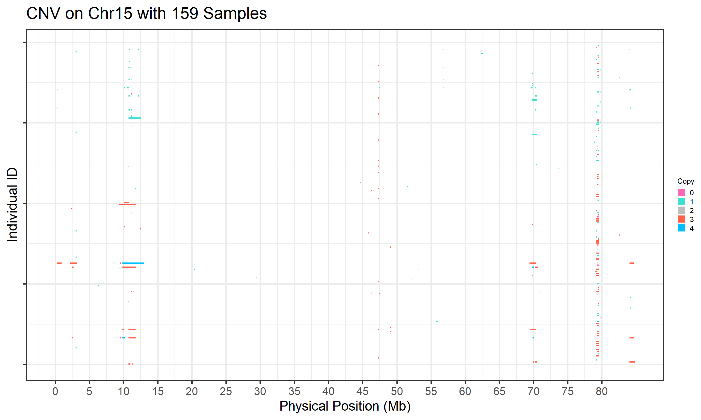
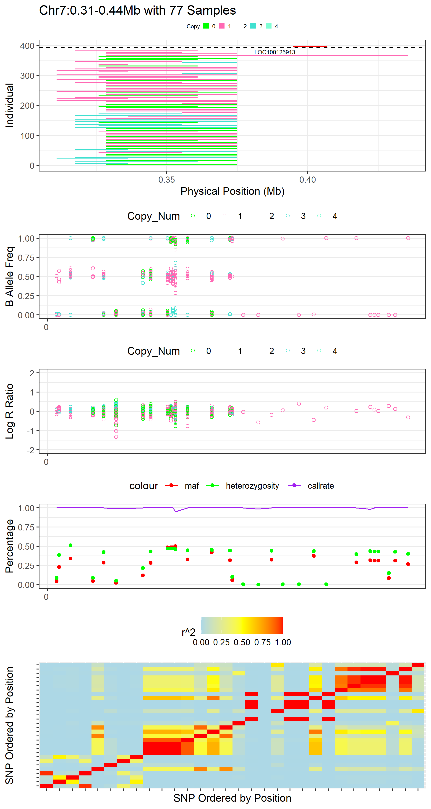
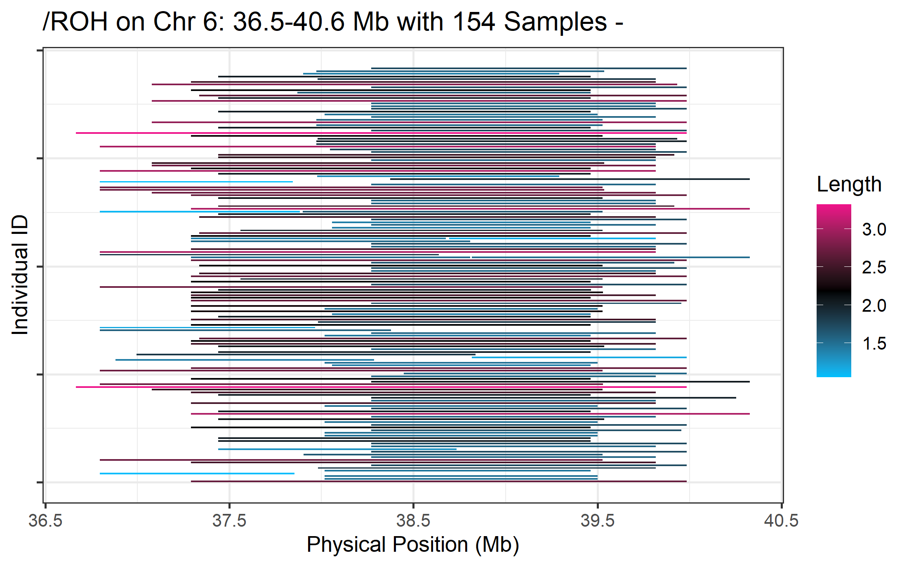

```{r, include = FALSE}
knitr::opts_chunk$set(
  collapse = TRUE,
  comment = "#>"
)
```

# Introduction
This package was originally designed for the Post-analysis of CNV results inferred from PennCNV and CNVPartition (GenomeStudio). However, it has now been expanded to accept input files in standard formats for a wider range of applications. Our motivation is to provide a standard, reproducible and time-saving pipeline for the post-analysis of CNVs and ROHs detected from SNP genotyping data for the majority of diploid Species. The functions provided in this package can be categorised into five sections: Conversion, Summary, Annotation, Comparison and Visualization. The most useful features provided are: integrating summarized results, generating lists of CNVR, annotating the results with known gene positions, plotting CNVR distribution maps, and producing customised visualisations of CNVs and ROHs with gene and other related information on one plot. This package also supports a range of customisations, including the colour, size of high resolution figures, and output folder, avoiding conflict between the results of different runs. Running through all functions detailed in the vignette could help us to identify and explore the most interesting genomic regions more easily. In the following sections, we will present how to use the functions provided in this package to solve these problems.

# Prerequisite
First, to run this package, we need to make sure that R (Version >= 3.5.2) is installed in your computer (R download link: https://www.r-project.org/).<br> Once R is installed, the 'HandyCNV' package can be installed from Github repository by running the following script:
```{r}
#library(remotes)
#install_github(repo = "JH-Zhou/HandyCNV", auth_token = "3d2ac98e4c297bab332f1e68b3b2d49f3a17d6aa")
```
Then, we need to load the 'HandyCNV' package in order to run the following examples. This can be done using the `library` function as shown below.
```{r setup}
library(HandyCNV)
```

To start playing with this package, we first need to prepare at least one CNV result list. With only CNV results as an input file, we can explore the functions from section 1 to section 10 as below. But to get more interesting and potentially valuable results, we will have to prepare additional input files, including the map file and signal intensity file for the SNP chip used to generate the CNV list, the pedigree of the samples, and Plink format (bed, bim and fam) genotype files. Many of these files are already required during CNV discovery, and by generating them eaarly in the pipeline, you will find that the rest of workflow will be much easier and faster. We will be introducing how to prepare each of the input files in the relevant chunks below.

# Demo data
We have provided some internal demo data, which should installed with package, in order to demonstrate how to use this package.<br>

We can access the demo data using the built-in R function `system.file` (see examples below). In the demo data, the first CNV results file is the default output from PennCNV with the ARS-UCD 1.2 (ARS) cattle reference genome. The second CNV results file contains the default output from CNVPartition with UMD 3.1 (UMD) cattle reference genome, and the third CNV list is an example of a standard input file that could be prepared from CNV results inferred by other tools.<br>

Note: If you prefer not to test with this demo data, just skip this step to section 1 and use your own data instead.
```{r}
cnv_penn_ars <- system.file("extdata", "Demo_data/cnv_results/ARS_PennCNV_WGC.goodcnv", package = "HandyCNV")
cnv_part_umd <- system.file("extdata", "Demo_data/cnv_results/UMD_CNVPartition.txt", package = "HandyCNV")
cnv_other_umd <- system.file("extdata", "Demo_data/cnv_results/UMD_Standard_CNV.txt", package = "HandyCNV")
```

#Setting up a working directory
To start the analysis, let's first set up the working directory. This will help ensure that all results will be saved in the same directory.
```{r eval=FALSE}
setwd(dir = "C:/Users/handy_test") #remember to replace the path with your own 
```

# What issues can this package solve?
As above we mentioned, the functions in the package have been categorised into five sections: Conversion, Summary, Annotation, Comparison and Visualization.
Functions in the Conversion section could, for example, be used to convert coordinates between the default and target mapfiles provided by users; this would be useful if we are detecting CNVs with two different reference genomes. The converted map files can be output in formats suitable for use in Plink, PennCNV and our package 'HandyCNV'. It is also possible to convert coordinates for intervals (CNV, CNVR, QTL et al) between the defaults and target maps, which might useful when comparing the results to those of other researchers.
Functions included in the Summarization section allow the formatting and plotting of outputs, such as producing detailed summaries of CNVs and ROHs, making CNV summary plots, generating CNV regions (CNVRs), and plotting CNVR distribution maps.
The Annotation section allows the downloading of reference gene lists from the UCSC website, enabling the annotation of CNV, CNVR, ROH or other intervals with gene locations.
The Comparison section facilitates the comparison of CNVs, CNVRs, Gene Frequent Lists and any other intervals. The highlight of this section is that comparison of CNVs and CNVRs will produce reports detailing comparison results on both individual and population levels, and all comparison results are relative to both input files.
Finally, the Visualization section contains functions to support customised CNV and ROH plotting by chromosome, specific sample, regions of interest, or target genes (plotting by gene is not yet available for ROH). It is also possible to annotate the plots with other information, such as gene locations, log R ratio, B Allele Frequency, SNP genotype, LD or the source of CNVs. These functions can also plot genes separately from reference gene lists, which might useful for comparing outputs with plots from other studies.

Now, let's start to explore the functions in `HandyCNV`.

## 1. How do we prepare the standard cnv input file for `HandyCNV` and get a quick summary?
We can use `cnv_clean` function to convert cnv results to standard format. This function will also produce a brief summary of CNV results.<br>
First, let's format the sample CNV results from PennCNV.<br> 
Note: <br> 
a. When formatting results in PennCNV format, the corresponding CNV input argument is 'penncnv'.<br> 
b. Default PennCNV results in Sample ID columns usually have the file path ahead the Sample ID. For example with the file "/home/zjhang027/C/final_403_penncnv/201094560082_R03C01.txt", the pattern 'cnv/' before the sample ID is unique, so we can take it as the separator using the argument `penn_id_sep = "cnv/"` to extract the wanted sample ID.
```{r cnv_clean_penn, echo=TRUE, warning=FALSE}
cnv_clean(penncnv = cnv_penn_ars, #when running your own data, set this argument to 'penncnv = "localpath/file"'
          penn_id_sep = "cnv/", #take the unique pattern as a separator to extract the sample ID 
          drop_length = 5, # the maximum CNV length threshold (in Mb); CNVs larger than this value will be deleted
          folder = "cnv_clean") #create a new folder to save results 
```

Next, let's format a second set of CNV results, this time produced using CNVPartition.<br> 
Note: The corresponding input argument is `cnvpartition` for CNV result from CNVPartition.
```{r cnv_clean_part, echo=TRUE, warning=FALSE}
cnv_clean(cnvpartition = cnv_part_umd, #when running your own data, set this argument by 'cnvpartition = "localpath/file"' 
          drop_length = 5, #the maximum CNV length threshold (in Mb); CNVs larger than this value will be deleted
          folder = "cnv_clean") 
```
If the CNV results were not produced by PennCNV or CNVPartition, we need to arrange the CNV results into the standard format, then use the 'standard_cnv' argument instead. The standard CNV input list should include the following columns (in order):  'Sample_ID', "Chr", "Start", "End" and "CNV_Value".
```{r table1, message=FALSE, warning=FALSE, results='asis'}
tabl <- "
|Sample_ID           |Chr |Start   |End     |CNV_Value |
|--------------------|----|--------|--------|----------|
|201977910077_R05C01 |6   |9087392 |9250902 |1         |
|201094560084_R06C02 |7   |28583247|28621254|3         |
|201094560084_R06C02 |7   |37214745|37238472|1         |
|201094560067_R08C02 |4   |6248795 |6425277 |3         |
|201094560067_R08C02 |4   |66567442|66830563|3         |" 
```

Let's run 'cnv_clean' on the third Standard CNV input file. Note that we are using the argument 'standard_cnv' for the third CNV result.
```{r}
cnv_clean(standard_cnv = cnv_other_umd, #when running your own data, set this argument by 'standard_cnv = "localpath/file"'
          drop_length = 5, #the maximum CNV length threshold (in Mb); CNVs larger than this value will be deleted
          folder = "cnv_clean")
```

## 2 How to visualize CNVs?
'cnv_visual' function are support to visualize CNV by Chromosome, Single Sample, Interested Region and Target Genes.

### 2.1 How to have a quick overview of all CNVs on each chromosome?
Once we got the standard clean_cnv result, we can use 'cnv_visual' function to plot all CNV to have a quick look if there any special patterns in CNV results .<br>
Now, let's visualizing the whole CNVs through all Chromosomes for Penn results at first.
```{r fig.show='hide', message=FALSE, warning=FALSE, echo=TRUE}
cnv_visual(clean_cnv = "cnv_clean/penncnv_clean.cnv", #standard file was generated by 'cnv_clean' function in section 1
           max_chr = 29, #select how many Chromosomes to plot 
           width_1 = 20, #optional,adjust the width of final plot
           height_1 =12, #optional,adjust the height of final plot
           folder = "cnv_visual_all_penn")
```
{width=320px}

Let's now to visualize CNVs from Part results by all Chromosome. We can adjust the size of final figure by setting 'width_1' and 'height_1'.
```{r fig.show='hide', message=FALSE, warning=FALSE, echo=TRUE, results='hide'}
cnv_visual(clean_cnv = "cnv_clean/cnvpart_clean.cnv", #standard file was generated by 'cnv_clean' function in section 1
           max_chr = 29, #select how many Chromosomes to plot
           width_1 = 20, #optional,adjust the width of final plot
           height_1 = 12, #optional,adjust the height of final plot
           folder = "cnv_visual_all_part", )
```
{width=320px}

### 2.2 How to plot CNV in an interested region?
After we plotted all CNVs on each chromosome, we might find some region are interested, we can add 'chr_id', 'start_position' and 'end_position' in 'cnv_visual' function to plot it. Here we are taking the region of Chr 15:77-80.1221 Mb in Penn result as example.
```{r fig.show='hide', warning=FALSE}
cnv_visual(clean_cnv = "cnv_clean/penncnv_clean.cnv", #standard file was generated by 'cnv_clean' function in section 1
           chr_id = 15, #set Chromosome
           start_position = 77, #set start position, unit is 'Mb'
           end_position = 80.1221, #set end position, unit is 'Mb'
           col_0 = "red", #optional, customize color for o copy CNV 
           col_1 = "orange", #optional, customize color for 1 copy CNV 
           col_3 = "blue", #optional, customize color for 3 copy CNV 
           col_4 = "green", #optional, customize color for 4 copy CNV 
           width_1 = 13, #optional, adjust the width of final plot
           height_1 = 10, #optional, adjust the height of final plot
           folder = "cnv_visual")
```
{width=320px}

### 2.3 How to plot CNV in an interested sample?
Here we need to assign the Sample ID to 'individual_id' and clean CNV list to 'clean_cnv' in 'cnv_visual' function, then the individual CNV plot will saved in working directory. In this example, the sample "201094560076_R03C02" has the most CNVs in Penn results, let's try to plot it have a look. <br> Note: The 'individual_cnv_count.txt' file will generate at section 3 when making summary plots, we can choose the interested individual in that file.
```{r fig.show='hide', warning=FALSE}
cnv_visual(clean_cnv = "cnv_clean//penncnv_clean.cnv", #standard file was generated by 'cnv_clean' function in section 1
           individual_id = "201094560076_R03C02", #set the sample ID  
           width_1 = 20, #optional, adjust the width of final plot
           height_1 = 13, #optional. adjust the height of final plot
           folder = "cnv_visual")
```
{width=320px}

### 2.4 How to plot an interested Gene to see how many samples had CNV with it?
The idea to plot CNV by Target Gene is to avoid the ambitious statements when report important candidate genes after annotation for CNVRs. If we think one gene is important in CNV analysis, it's better to present what the frequency of the genes that has structure variation in the experimental population, plot CNV by gene will present how many sample has the gene with copy number variation directly. 
Note: The input file 'cnv_annotation.txt' will generate in section 5.2. Play it after we annotated the gene to CNV results.
```{r fig.show='hide', warning=FALSE}
cnv_visual(clean_cnv = "call_gene_Penn_UCSC/cnv_annotation.txt", #here we need the annotated CNV list, generated by 'call_gene' in section 5.2
           target_gene = "BLA-DQB", #set the gene name we are interested
           col_0 = "darkorchid4",  #optional, customize color for o copy CNV 
           col_1 = "dodgerblue3",  #optional, customize color for 1 copy CNV 
           col_3 = "violetred3",  #optional, customize color for 3 copy CNV 
           col_4 = "orangered3",  #optional, customize color for 4 copy CNV
           width_1 = 13, #adjust the width of final plot
           height_1 = 10, #adjust the width of final plot
           folder = "cnv_visual")
```
{width=320px}

### 2.5 How to present annotated gene above CNV plot?
The idea is to plot CNV and gene in given region separately at first, then combine two plot together. So we need to provide two input files to arguments 'clean_cnv' and 'refgene' meanwhile. Then set region we are interested.
Note: Here we need the reference gene list, it will be generated by 'get_refgene' function in section 5.
```{r, fig.show='hide'}
cnv_visual(clean_cnv = "cnv_clean/penncnv_clean.cnv", #standard file was generated by 'cnv_clean' function in section 1
           refgene = "refgene/cow_ARS_UCSC.txt", #standard input file will generated by the function 'get_refgene' in Section 5
           chr_id = 23, #set Chromosome
           start_position = 25.56, #set start position, unit is 'Mb'
           end_position = 25.74, #set end position, unit is 'Mb'
           gene_font_size = 2.2, #optional, adjust the size of gene font
           show_name = c(25.66,27.72), #optional, show the gene in the given interval, maximum support two intervals
           col_0 = "tomato", #optional, customize color for o copy CNV 
           col_1 = "hotpink", #optional, customize color for 1 copy CNV 
           col_3 = "turquoise", #optional, customize color for 3 copy CNV 
           col_4 = "aquamarine", #optional, customize color for 4 copy CNV 
           col_gene = "red", #optional, customize color of gene  
           width_1 = 14, #optional, adjust the width of final plot
           height_1 = 10, #optional, adjust the height of final plot
           folder = "cnv_visual")
```
{width=320px}

## 3. How to make summary figures for CNV results?
After we got the clean CNV results, we can use 'cnv_summary_plot' function to make summary plots. Which will plot CNV results by Length Group, CNV Type, Chromosome and Individuals, it's also could make two types combination plot from above figures.<br> First, let's plotting for Part_cnv result. The process are the same for the rest of two CNV results, so we skip to repeated the same work.
```{r cnv_summary_plot_penn, fig.show='hide', warning=FALSE}
cnv_summary_plot(clean_cnv = "cnv_clean/cnvpart_clean.cnv", #standard file was generated by 'cnv_clean' function in section 1
                 length_group = c(0.05, 0.1, 0.2, 0.3, 0.4, 0.5, 0.6, 0.7, 1, 2, 5), # optional, set group of vectors to divide CNV length, unit is Mb. such as vector of ‘c(0.05, 0.3, 1)’, means divide the CNV length into four group: '<0.05Mb', '0.05 - 0.3Mb', '0.3-1Mb' and '>1Mb', maximum can accept 11 values
                 col_0 = "red", #optional, customize color for o copy CNV 
                 col_1 = "black", #optional, customize color for o copy CNV 
                 col_3 = "purple", #optional, customize color for o copy CNV 
                 col_4 = "blue", #optional, customize color for o copy CNV 
                 plot_sum_1 = TRUE,  #optional, make sum combination plot 1
                 height_sum1 = 26, #optional, adjust the size of sum plot 1
                 width_sum1 = 20, #optional, adjust the size of sum plot 1
                 plot_sum_2 = TRUE, #optional, make sum combination plot 2
                 height_sum2 = 20, #optional, adjust the size of sum plot 2
                 width_sum2 = 27, #optional, adjust the size of sum plot 2
                 folder = "cnv_summary_plot_penn")
```
{width=320px}

{width=320px}

## 4. How to generate CNVR (CNV Region) from CNV results?
Let's generate CNVR for Penn CNV results at first. Attention at here, 'call_cnvr' function support to set the maximum number of chromosome to generate CNVRs. In our example, the species is Bovine, so we set 'chr_set' as '29'. This function will report three tables, one is CNVR list, one of a brief summary table about the length, number of CNVR under type of Deletion, Duplication and Mixed, and another is total length and number of CNVR on each chromosome. The process will unite all CNVs which are overlapped at least one bp together, then sort by Chromosome, Start position, End position, then assign the CNVR ID to each unique interval by order. After that, we will count the CNV number within an CNVR as the frequency of that CNVR. In this way, the new generated CNVR list won't has any overlapped intervals. One of the output file 'individual_cnv_cnvr.txt' contain both CNVR and CNV information every sample, this file might suitable for the CNV-GWAS analysis.
```{r echo=TRUE, warning=FALSE}
call_cnvr(clean_cnv = "cnv_clean/penncnv_clean.cnv", #standard file was generated by 'cnv_clean' function in section 1
          chr_set = 29, #Set the maximum number of Chromosome, our species is Cattle, autosome number is 29
          folder = "call_cnvr_penn")
```

Secondly, let's generate CNVRs for Part CNV results. In order to avoid mixing the results among different files, we can set 'folder' arguments to assign a distinguish name of new generated folder. 
```{r warning=FALSE, echo=TRUE, results='hide'}
call_cnvr(clean_cnv = "cnv_clean/cnvpart_clean.cnv", #standard file was generated by 'cnv_clean' function in section 1
          chr_set = '29', 
          folder = "call_cnvr_part")
```

Then let's call CNVR for the third file which are the standard CNV input file prepared by ourself.
```{r include=TRUE, echo=TRUE, results='hide'}
call_cnvr(clean_cnv = "cnv_clean/cleancnv.cnv", #standard file was generated by 'cnv_clean' function in section 1
          chr_set = 29,
          folder = "call_cnvr_standard")
```

## 5. How to annotated genes for CNVR and CNV?
Once we got cnv and cnvr results, we might want to see how many genes located in these structure variation region. We can annotated gene to CNV and CNVR by 'call_gene' function. But we need to prepare the right reference gene lists before we calling genes. Let's move to next section to see how to prepare the reference gene lists. 

### 5.1 How to download the reference gene lists we need?
Here we can use 'get_refgene' to automatically download the reference gene and convert it to the standard format. At first, let's run 'get_refgene' without arguments to see which reference gene we can download. If you don't find the information you're looking for, please feel free to contact our maintainer to update it to you. Now it only support to download reference gene from UCSC website, we may add more features if there are demands.
```{r}
get_refgene()
```

Now, let's get the reference gene for Penn result at first, the Penn result are using ARS-UCD 1.2 as reference genome. So We can choose "cow_ARS_UCSC" or "cow_ARS_ENS" from above lists to download it, the 'ENS' indicate to Ensembl reference gene. The output will saving in the new generated folder 'refgene'.
```{r}
get_refgene(gene_version = "Cow_ARS_UCSC")
```
We can also download the ARS-UCD 1.2 with Ensembl reference gene, let's try it.
```{r}
get_refgene(gene_version = "Cow_ARS_ENS")
```

Then let's get reference gene for Part and Standard CNV result, both of them with UMD 3.1 version reference genome, the 'Cow_UMD_UCSC' is the option.
```{r}
get_refgene(gene_version = "Cow_UMD_UCSC")
```

Now we have all well-prepared reference gene lists, let's moving to next section to 'call_gene'.

### 5.2 How to annotate genes for CNV and CNVR?
In 'call_gene' function, there are three arguments, 'ref_gene' is essential, but 'interval' and 'clean_cnv' you can choose one of them or select all. We suggest to set both 'interval' and 'clean_cnv' simultaneously, this step is important, because it will reporting the frequency of all annotated gene which by counting how many CNVs overlapped to a gene within a CNVR. We can use the output 'gene_freq_cnv.txt' make comparison between different CNV results to find out the consensus genes in section 10.<br> 

The term of 'interval' may confuse you, we call it as this because it not limited on CNVR list, it could be a CNV, QTL, Haplotype list or any other interval list with standard input format.<br> Now let's going to call genes for these structure variations.<br> 

First, we calling gene for Penn results, need to pay attention to here the results is the ARS version, we need to choose the right reference gene list.
```{r}
call_gene(refgene = "refgene/cow_ARS_ENS.txt", #standard file was generated by 'get_refgene' function in section 5.1
          interval = "call_cnvr_Penn/cnvr.txt", #optional, standard file was generated by 'call_cnvr' function in section 4
          clean_cnv = "cnv_clean/penncnv_clean.cnv", #optional, standard file was generated by 'cnv_clean' function in section 1
          folder = "call_gene_Penn_Ens")
```

How about we using the reference of ARS UCSC to call genes? 
```{r message=FALSE, echo=TRUE, results='hide'}
call_gene(refgene = "refgene/cow_ARS_UCSC.txt", #standard file was generated by 'get_refgene' function in section 5.1
          interval = "call_cnvr_Penn/cnvr.txt", #standard file was generated by 'call_cnvr' function in section 4
          clean_cnv = "cnv_clean/penncnv_clean.cnv", #optional, standard file was generated by 'cnv_clean' function in section 1
          folder = "call_gene_Penn_UCSC")
```
We see the results from two reference gene lists are slightly different. That's could because of each database has different Users to submit their results, not all researcher are using the same methods, so the position and quantity of genes might slightly different even in the same reference genome. All the information could provide a reference to us, and the further validation need ourselves to explore.<br> 

Secondly, let's call gene for the Part results, similarly, we choose both CNVR and CNV, and set the new folder name by arguments. Pay attention at here, Part results in example is UMD version, we need to select the reference gene with UMD version. 
```{r message=FALSE, echo=TRUE, results='hide'}
call_gene(refgene = "refgene/cow_UMD_UCSC.txt", #standard file was generated by 'get_refgene' function in section 5.1
          interval = "call_cnvr_Part/cnvr.txt", #standard file was generated by 'call_cnvr' function in section 4
          clean_cnv = "cnv_clean/cnvpart_clean.cnv", #optional, standard file was generated by 'cnv_clean' function in section 1
          folder = "call_gene_Part")
```

Then let's call gene for the third CNV results
```{r echo=TRUE, results='hide'}
call_gene(refgene = "refgene/cow_ARS_UCSC.txt", #standard file was generated by 'get_refgene' function in section 5.1
          interval = "call_cnvr_standard/cnvr.txt", #standard file was generated by 'call_cnvr' function in section 4
          clean_cnv = "cnv_clean/cleancnv.cnv", #optional, standard file was generated by 'cnv_clean' function in section 1
          folder = "call_gene_standard_ARS_UCSC")
```

## 6. How to plot CNVR distribution map?
The 'cnvr_plot' is used to make CNVR distribution plot. Only need to assign the standard CNVR list file to 'cnvr' argument and the reference genome assembly. For Bovine data, we set both ARS and UMD as defaults length of chromosomes, so user could select the corresponding version by 'assembly' argument. For the other species, we can just assign any text to 'assembly' argument, for example, plotting cnvr map for human data, just set 'assembly = "human"', then the function will extract the maximum length of each chromosomes and generate a border of chromosome automatically. <br> 

Now we plotting cnvr map for Penn result at first.
```{r, fig.show='hide'}
cnvr_plot(cnvr = "call_cnvr_Penn/cnvr.txt", #standard file was generated by 'call_cnvr' function in section 4
          assembly = "ARS", #cattle could select 'UMD' or 'ARS', other species could assign the name of species
          loss_col = "green2", #optional, adjust the color of Loss type of CNVR
          gain_col = "red", #optional, adjust the color of Gain type of CNVR
          mixed_col = "black",  #optional, adjust the color of Mixed type of CNVR
          legend_x = 127, #optional, adjust the horizontal position of legend
          legend_y = 30,  #optional, adjust the vertical position of legend
          height_1 = 14, #optional, adjust the height of CNVR plot
          width_1 = 10, #optional, adjust the width of CNVR plot
          folder = "cnvr_plot_penn")
```
{width=320px}

Then we plotting cnvr map for the Part result. The fixed legend position might not suitable for all species, We can adjust the position of legend in the map figure by 'legend_x' and 'legend_y'.
```{r, fig.show='hide'}
cnvr_plot(cnvr = "call_cnvr_Part/cnvr.txt", #standard file was generated by 'call_cnvr' function in section 4
          assembly = "UMD", #cattle could select 'UMD' or 'ARS', other species could assign the name of species
          loss_col = "darkorchid", #optional, adjust the color of Loss type of CNVR
          gain_col = "gold", #optional, adjust the color of Gain type of CNVR
          mixed_col = "tomato",  #optional, adjust the color of Mixed type of CNVR
          legend_x = 127, #optional, adjust the horizontal position of legend
          legend_y = 30,  #optional, adjust the vertical position of legend
          height_1 = 14, #optional, adjust the height of CNVR plot
          width_1 = 10, #optional, adjust the width of CNVR plot
          folder = "cnvr_plot_part")
```
{width=320px}

## 7. How to plot all high frequent CNVRs at once?
It always interested to see which genome region are most frequency to have the structure variation. We can plotting all the high frequent region by 'cnvr_plot' function.<br> 

Let's plot some for Penn Result at first. Remember to set the name of new folder to save results.
```{r fig.show='hide', warning=FALSE, message=FALSE, echo=TRUE, results='hide'}
cnvr_plot(cnvr = "call_cnvr_Penn/cnvr.txt", #standard file was generated by 'call_cnvr' function in section 4
          clean_cnv = "cnv_clean/penncnv_clean.cnv", #standard file was generated by 'cnv_clean' function in section 1
          refgene = "refgene/cow_ARS_ENS.txt", #standard file was generated by 'get_refgene' function in section 5.1
          sample_size = 382, #total sample size
          common_cnv_threshold = 0.18, #the proportion of Sample has CNV
          width_1 = 10, #optional, adjust the width of final plot
          height_1 = 10, #optional, adjust the height of final plot
          col_gene = "blue", #optional, adjust the color of annotated gene
          gene_font_size = 2.5, #optional, adjust the font size of annotated gene
          folder = "high_freq_cnvr_penn")
```
{width=320px}


## 8. How to compare CNV between different results?
Comparison of CNVs it's an inescapable topic if you doing CNV analysis, especially for the SNP genotyping data, we are probability will using more than two software and different models to detect CNV, then the comparison between these results is a pretty common task. To tackle this problem we can now using 'compare_cnv' function to make comparison on both individual level and population level. The individual level means to check how many overlap CNVs on the same individual between two CNV results, in this way we could check the similarity of the two results. The population level means the comparison will ignore if the CNVs in the same individual, it will check the overlap through the population level. In this way, we will more concerning about the repeat-ability of the CNVs among these results.<br>  

Please pay attention at here, when compare CNVs we need to make sure the coordinates (physical position of CNVs) of two input files has the same reference genome, otherwise the results has no sense. <br>

Now, let's pretending the example files are in the same version of reference genome, try to make a comparison between the two CNV results of Penn and Part at first to see how it works. We will talking about how to prepare the map file we need in the next heading, then correcting the this comparison at here. 
```{r, fig.show='hide'}
compare_cnv(cnv_def = "cnv_clean/cleancnv.cnv", #standard file was generated by 'cnv_clean' function in section 1
            cnv_tar = "cnv_clean/penncnv_clean.cnv", #standard file was generated by 'cnv_clean' function in section 1
            width_1 = 12, #optional, adjust the width of final plot
            height_1 = 11, #optional, adjust the height of final plot
            legend_x = 0.9, #optional, adjust the horizontal position of final plot
            legend_y = 0.9, #optional, adjust the vertical position of final plot
            col_1 = "pink", #optional, adjust the color of Non-Overlapped part
            col_2 = "lightblue", #optional, adjust the color of Overlapped part
            plot_caption = TRUE, #optional, show the Note information in plot or not
            folder = "compare_cnv_PartUMD_Vs_PennUMD")
```
{width=330px}

## 9. How to compare CNVRs between different results?
The principle to make comparison of CNVRs is similar to 'compare_cnv', it's support to compare two CNVRs results with the same version of reference genome, and also can convert the coordinates to each input files if users provide the default and target map file to the 'def_tar_map' argument. Same as testing on 'compare_cnv' function, although here in our example the two CNVRs results are in ARS-UCD 1.2 and UMD 3.1 version, let pretending it in the same version, we only want to present how the 'compare_cnvr' function works for the input files are the same version. We will continue to talking about how to prepare the map file in Next heading.<br> 

Let's try to use 'compare_cnvr' now.
```{r, fig.show='hide'}
compare_cnvr(cnvr_def  = "call_cnvr_Part/cnvr.txt", #standard file was generated by 'call_cnvr' function in section 4
             cnvr_tar  = "call_cnvr_standard/cnvr.txt", #standard file was generated by 'call_cnvr' function in section 4
             width_1 = 8, #optional, adjust the width of comparison plot
             height_1 = 8, #optional, adjust the height of comparison plot
             hjust_prop = 0.2, #optional, adjust the horizontal position of the proportion number present in plot
             hjust_num = 1.6, #optional, adjust the horizontal position of the number present in plot
             col_1 = "gray15", #optional, adjust the color of Non-overlapped part
             col_2 = "forestgreen", #optional, adjust the color of Overlapped part
             folder = "compare_cnvr_PartUMD_Penn_UMD")
```
{width=320px}

## 10. How to find the consensus genes among multiple CNV results?
The most interested part of CNV analysis is to find out which genes could has structure variation and check out the frequency of that aberrant genes in our samples. When we used the 'call_gene' function in section 5.2 we already got the gene frequency list for each CNV results. We can take that results as input in 'compare_gene' function to find the consensus genes between multiple CNV results.<br> 

Now, let's make comparison of annotated gene-lists for Penn and Part results in example. We can assign the argument 'gene_freq_1' and 'gene_freq_2' with 'gene_freq_cnv.txt' files from 'call_gene_Part' and 'call_gene_Penn' folders. Then we need to set a common gene threshold to 'common_gene_threshold', it's an integer number, in our example the sample size is 400, let's say the prevalence of common CNV is 5%, then the 'common_gene_threshold' could calculate as 400 * 5%  = 20. The function also support we set the title of labels of X and Y axis and the size in the final figures.
```{r, fig.show='hide'}
compare_gene(gene_freq_1 = "call_gene_Part/gene_freq_cnv.txt", #standard file was generated by 'call_gene' function in Section 5.2
             gene_freq_2 = "call_gene_Penn_Ens/gene_freq_cnv.txt", #standard file was generated by 'call_gene' function in Section 5.2
             title_1 = "Bovine Part", #optional, adjust the title of input file 1 present in final plot 
             title_2 = "Bovine Penn", #optional, adjust the title of input file 2 present in final plot 
             common_gene_threshold = 20, #optional, the threshold is the gene frequency, here 20 means the Gene frequency exceed 20 in two input lists will be regarded as common gene. 
             col_1 = "red", #optional, set the color of 'Common High' genes
             col_2 = "blue", #optional, set the color of 'Common Low' genes
             col_3 = "gold", #optional, set the color of 'High_Freq_list_1' genes
             col_4 = "green", #optional, set the color of 'High_Freq_list_2' genes
             height_1 = 10, #optional, adjust the height of final plot
             width_1 =  12, #optional, adjust the width of final 
             folder = "compare_gene_Part_Vs_Penn")
```
{width=300px}

We can make comparison for three gene frequency lists, just adding one more input file, the comparison figure will be a 3D plot.
```{r, fig.show='hide'}
compare_gene(gene_freq_1 = "call_gene_Part/gene_freq_cnv.txt", #standard file was generated by 'call_gene' function in Section 5.2
             gene_freq_2 = "call_gene_Penn_Ens/gene_freq_cnv.txt", #standard file was generated by 'call_gene' function in Section 5.2
             gene_freq_3 = "call_gene_standard_ARS_UCSC/gene_freq_cnv.txt", #standard file was generated by 'call_gene' function in Section 5.2
             title_1 = "Part", #optional, adjust the title of input file 1 present in final plot 
             title_2 = "ENS", #optional, adjust the title of input file 2 present in final plot 
             title_3 = "UCSC", #optional, adjust the title of input file 3 present in final plot 
             common_gene_threshold = 15,
             height_1 = 5.8, #optional, adjust the height of final plot
             width_1 = 5.8, #optional, adjust the width of final plot
             folder = "compare_gene_three_lists")
```
{width=320px}

We can also make comparison for four gene frequency lists, just adding one more input file again, the comparison figure will be a heat-map. In our example we only have three annotated gene lists, but here we only present the effect of this function, let's put gene frequent list of Part as the firth argument.
```{r, fig.show='hide'}
compare_gene(gene_freq_1 = "call_gene_Part/gene_freq_cnv.txt", #standard file was generated by 'call_gene' function in Section 5.2
             gene_freq_2 = "call_gene_Penn_UCSC/gene_freq_cnv.txt", #standard file was generated by 'call_gene' function in Section 5.2
             gene_freq_3 = "call_gene_Part/gene_freq_cnv.txt", #standard file was generated by 'call_gene' function in Section 5.2
             gene_freq_4 = "call_gene_standard_ARS_UCSC/gene_freq_cnv.txt", #standard file was generated by 'call_gene' function in Section 5.2
             title_1 = "Part", #optional, adjust the title of input file 1 present in final plot 
             title_2 = "ENS", #optional, adjust the title of input file 2 present in final plot 
             title_3 = "UCSC", #optional, adjust the title of input file 3 present in final plot 
             title_4 = "PUCSC", #optional, adjust the title of input file 4 present in final plot 
             col_1 = "red", #optional, set the color of High frequency genes
             col_2 = "yellow", #optional, set the color of Low frequency genes
             common_gene_threshold = 20,
             height_1 = 9, #optional, adjust the height of final plot
             width_1 = 11, #optional, adjust the width of final plot
             folder = "compare_gene_four_lists")
```
{width=300}

# Brief Summary and Explore More
Up to now, using above ten functions only requires users to provide the CNV results, when we run through at here, we already generated plenty of summary results including details information which could help us to dig more deeper. If we want to explore more, we could provide more information and combine with some functions to play with it. We will introduce what files do we need to prepare in each section.


## 11. How to create the map file used in 'HandyCNV' while comparing CNVs between different reference genome?
Here we can use 'convert_map' function to prepare map file. It need we provide two map files on relative versions. In our example, we considered two reference genome ARS-UCD 1.2 and UMD 3.1 of Bovine. On usual, we have a default map file export from GenomeStudio in Plink format, this file is in the standard format as an input in 'HandyCNV' (See table as below). We will have a target map file to convert, in this case, the target map is in ARS-UCD 1.2 version. <br>

Both map file should has same fixed formats as shown in the table below. The input map file can not have the title, but the order of four columns are 'Chromosome', 'SNP', 'Morgan Position'， 'Physical Position'. If unknown 'Morgan Position' we can assign the missing value as '0'. <br>

The output not only generate map files use in 'compare_cnv' and 'compare_cnvr', will also generate map file used in Plink and PennCNV for both inputs, the converting progress also make a comparison between these two input maps and generating the comparison details by tables and figures.
```{r table2, echo=TRUE, message=FALSE, warning=FALSE, results='asis'}
tabl <- "
-----------------------------------------
Chr   SNP           MorganPos PhysicalPos
---- ------------- ---------- -----------               
  5	  14636        	56.3275   56327514 
  5	  16084        	56.329	  56328962  
  5	  19597        	56.3325	  56332475  
  1	  1_115292065  	114.371	  114370731  
  1	  1_115292107  	114.371	  114370773 
-----------------------------------------"
```

Here we have the map file in internal database, let's get the path now.
```{r}
ars_map <- system.file("extdata", "Demo_data/map/ARS1.2_GGPHDV3.map", package = "HandyCNV")
umd_map <- system.file("extdata", "Demo_data/map/UMD3.1_Bovine.map", package = "HandyCNV")
```

When we got the path of default and target maps, let's convert the map files right now.
```{r fig.show='hide', warning=FALSE}
convert_map(default_map = umd_map, #when run your own data, set this argument by 'default_map = "localpath/file"'
            target_map = ars_map, #when run your own data, set this argument by 'target_map = "localpath/file"'
            defMap_title = "UMD 3.1", #set the label of axis
            tarMap_title = "ARS-UCD 1.2", #set the label of axis
            col_1 = "green4", #set color for the type of Match in SNP comparison plot
            col_2 = "red", #set color for the type of Unmatched in SNP comparison plot
            col_3 = "deeppink2", #set color for the bar of Target_Map in SNP density plot
            col_4 = "deeppink2", #set color for line of Target_map in density plot
            col_5 = "turquoise3", #set color for point of Default_Map in SNP density plot
            col_6 = "turquoise3", #set color for line of Default_map in SNP density plot
            species = "Bovine")
```
{width=320px}

{width=320px}

## 12. How to integrate the CNVs, Annotated genes, Log R ratio, B Allele Frequency, call rate, heterozygosity, missing value rate and Linkage Disequilibrium into a CNV Regin and plot as one figure?

The 'plot_cnvr_panorama' function was built for achieve this task. But we need provide more information to this function. Including:<br> 
a. CNVR results(generated by 'call_cnvr' in section 4)<br>
b. Annotated CNV file (generated by 'call_gene' function)<br> 
c. Signal Intensity file (In general it export from GenomeStudio which used in CNV detection process)<br> 
d. Map file (Four columns used in Plink or generated by 'convert_map' function)<br> 
e. Genotype files (generated by Plink with '--make-bed' flag which include BED, BIM, FAM three files).<br>

```{r fig.show='hide', warning=FALSE, message=FALSE}
plot_cnvr_panorama(cnvr = "call_cnvr_Penn/cnvr.txt", #standard file was generated by 'call_cnvr' function in section 4
                   cnv_annotation = "call_gene_Penn_UCSC/cnv_annotation.txt", #standard file was generated by 'call_gene' function in Section 5.2
                   intensity = "Demo_data/demo_intensity.txt", 
                   map = "Demo_data/demo.map", 
                   prefix_bed = "Demo_data/demo_HandyCNV", 
                   ld_heat = TRUE,
                   sample_size = 382, 
                   common_cnv_threshold = 0.18, 
                   col_0 = "green", #optional, customize color for o copy CNV 
                   col_1 = "hotpink", #optional, customize color for 1 copy CNV 
                   col_2 = "gray", #optional, customize color for 2 copy CNV 
                   col_3 = "turquoise", #optional, customize color for 3 copy CNV 
                   col_4 = "aquamarine", #optional, customize color for 4 copy CNV 
                   col_gene = "red", #optional, customize color of gene 
                   width_1 = 16,
                   height_1 = 30,
                   folder = "cnvr_panorama_heat_ld")
```
{width=150px}

For LD, we can plot the classical inverted triangle by setting "'ld_heat' = FALSE" which will using 'gaston' package to plot LD then convert it from base figure to grob object by 'ggplotify'. The shortage is this process are time consuming and some time can not work well for large LD region. So suggest you using 'ld_heat' at firt, then select some region plot with classical LD.
```{r eval=FALSE, warning=FALSE, include=FALSE, results='hide'}
plot_cnvr_panorama(cnvr = "call_cnvr_Penn/cnvr.txt", #standard file was generated by 'call_cnvr' function in section 4
                   cnv_annotation = "call_gene_Penn_UCSC/cnv_annotation.txt", #standard file was generated by 'call_gene' function in Section 5.2
                   intensity = "Demo_data/demo_intensity.txt", 
                   map = "Demo_data/demo.map", 
                   prefix_bed = "Demo_data/demo_HandyCNV", 
                   sample_size = 382, 
                   common_cnv_threshold = 0.18,
                   ld_heat = FALSE,
                   col_0 = "green", #optional, customize color for o copy CNV 
                   col_1 = "hotpink", #optional, customize color for 1 copy CNV 
                   col_2 = "gray", #optional, customize color for 2 copy CNV 
                   col_3 = "turquoise", #optional, customize color for 3 copy CNV 
                   col_4 = "aquamarine", #optional, customize color for 4 copy CNV 
                   col_gene = "red", #optional, customize color of gene  
                   width_1 = 16,
                   height_1 = 30,
                   folder = "cnvr_panorama_classical_ld")
```
{width=150px}
     
## 13. How to make a fast plot to show the source of the CNVs? 
We know the CNVs are heritable, to check if any CNVs are in the unique situation could help us find more interested region. The easiest way is to plot the CNVs by the source information, the source information could be the pedigree or the sampling region. For livestock (cattle, sheep or pig), we might have some samples are progenies of same male seed-stock, make CNV plot by the source of Sire should be fun. To make the plot, we need to prepare a Pedigree file as following format: 
```{r warning=FALSE, message=FALSE, echo=TRUE, results='hide'}
plot_cnvr_source(cnvr = "call_cnvr_Penn/cnvr.txt", #standard file was generated by 'call_cnvr' function in section 4
                clean_cnv = "cnv_clean/penncnv_clean.cnv", #standard file was generated by 'cnv_clean' function in section 1
                pedigree = system.file("extdata", "Demo_data/Pedigree/Pedigree.csv", package = "HandyCNV"), 
                Frequent_threshold = 80,
                height_1 = 20, 
                width_1 = 15)
```
{width=150px}

## 14. How to plot genes in a specific region and save it as figure seperatly?   
```{r, fig.show='hide'}
plot_gene(refgene = "refgene/cow_ARS_UCSC.txt", 
          chr_id = 7, 
          start = 11, 
          end = 12, 
          height_1 = 3, 
          width_1 = 10, 
          show_name = c(11.0, 11.35, 11.75, 12.00), 
          gene_font_size = 2.5)
```
{width=300px}

## 15. How to find out the high frequency ROH region?
ROH (Run of homozygosity) is 
```{r}
roh_window(roh = "cnv_clean/cnvpart_roh.cnv", 
           window_size = 2,
           length_autosomal = 2489.386, 
           threshold = 0.15, 
           folder = "roh_window", 
           col_higher = "red", 
           col_lower = "black", 
           height_1 = 15, 
           width_1 = 11, 
           legend_x = 0.92, 
           legend_y = 0.06,
           ncol_1 = 5)
```
{width=300px}

## 16. How to visualize ROH?
The method to visualize ROH is similar to visualizing CNVs, but for ROH we present color by the length. The 'roh_visual' function could plot ROH though all chromosome together or one by one, it support to users to plot any interested region, also could plot annotated gene in the corresponding location. <br>

### 16.1 Plot ROH on single chromosome. 
```{r warning=FALSE}
roh_visual(clean_roh = "cnv_clean/cnvpart_roh.cnv", 
           chr_id = 6, 
           width_1 = 14, 
           height_1 = 9, 
           folder = "roh_visual", 
           col_short = "red", 
           col_mid = "blue", 
           col_long = "black")
```
{width=300px}

### 16.2 plot ROH on destinate region.
We can plot ROH in a given region, let's plotting the region on Chr6:35.0-42.5 Mb.
```{r}
roh_visual(clean_roh = "cnv_clean/cnvpart_roh.cnv", 
           chr_id = 6, 
           start_position = 36.5, 
           end_position = 40.6, 
           width_1 = 16)
```
{width=300px}


### 16.3 Plot gene on interested ROH region.
```{r, fig.show='hide', results='hide'}
roh_visual(clean_roh = "cnv_clean/cnvpart_roh.cnv", 
           chr_id = 6, 
           start_position = 36.5, 
           end_position = 40.61, 
           refgene = "refgene/cow_UMD_UCSC.txt")
```
{width=300px}


### 16.4 Customise gene names on the annotation plot.
If the ROH region have too much genes, plotting all gene names will made the figure looks too busy. We can choose the most important region to plot by 'show_names' argument. We can set two region like this 'show_name = c(37.28, 37.49, 38.25, 39.52)', it means show the gene names in two region, the first region is (37.28 - 37.49 Mb) and second is (38.25 - 39.52 Mb).
```{r fig.show='hide', warning=FALSE, results='hide'}
roh_visual(clean_roh = "cnv_clean/cnvpart_roh.cnv", 
           chr_id = 6, 
           start_position = 36.5, 
           end_position = 40.5, 
           refgene = "refgene/cow_UMD_UCSC.txt", 
           show_name = c(37.28, 37.49, 38.25, 39.52), col_short = "black", col_mid = "green", col_long = "red")
```
{width=300px}

## 17. How to convert coordinats for CNV, CNVR, ROH or any other Intvervals?
The function 'convert_coord' can use to convert coordinates for Intervals lists, but now the usage are limited on the 'def_tar_map' file which generated by 'convert_map' function at the moment, and only working for converting the coordinates for the Intervals which from the same type of SNP Chips. Convert coordinates might change the total length of the interval, because of the Order of SNPs on the Chromosome might differ between various versions of reference genome, here we should pay attention to check the quality of Conversion, then use it with caution.<br>
2. Add 'proxy_range' argument to support to adjust the range of area to search and assign the 'proxy location' for the markers which are missing in the target map. The purpose is to try the best reduce the lost of Intervals after conversion.  The principal is try to reduce the length of interval which were assigned proxy location. For the start position, the searching range start from the missing position toward to down steam, then extract the minimum value as proxy position. For end position, the searching range start from missing location toward to the up steam, then assign the largest value as proxy position, If the searching region are no any point exist, will assign the "Missing" instead. 3. Add argument 'len_diff_threshold' to make quality control on the new converted Intervals by check the difference of length between conversion and original Intervals. Only the new conversion smaller than the threshold will label as 'Pass'. 4. Add summary table to summarize how many Intervals are succeed conversion, what the difference of length between converted Intervals and original Intervals.  
Here, we try to convert the Part CNVR results from UMD coordinate to ARS1.2 version, let's see what the quality are and how should we use it. 
```{r}
convert_coord(input_def = "cnv_clean/cleancnv.cnv", 
              def_tar_map = "convert_map/def_tar_map.map",
              proxy_range = 100000,
              len_diff_threshold = 100000,
              folder = "convert_coord_penn_cnv")
```
We can also convert coordinates from target map to default map, let's try to convert the Penn ARS results to Penn UMD results. After convert coordinates of CNV and CNVR, we could use the results which passed the quality check to make comparison by 'compare_cnv' and 'compare_cnvr' as section 8 and 9 described.
```{r}
convert_coord(input_def = "call_cnvr_standard/cnvr.txt", 
              proxy_range = 100000,
              len_diff_threshold = 100000,
              def_tar_map = "convert_map/def_tar_map.map", 
              folder = "convert_coord_penn_cnvR")
```


