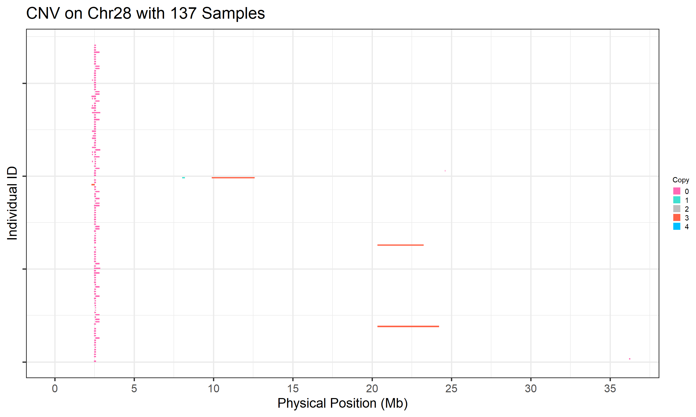
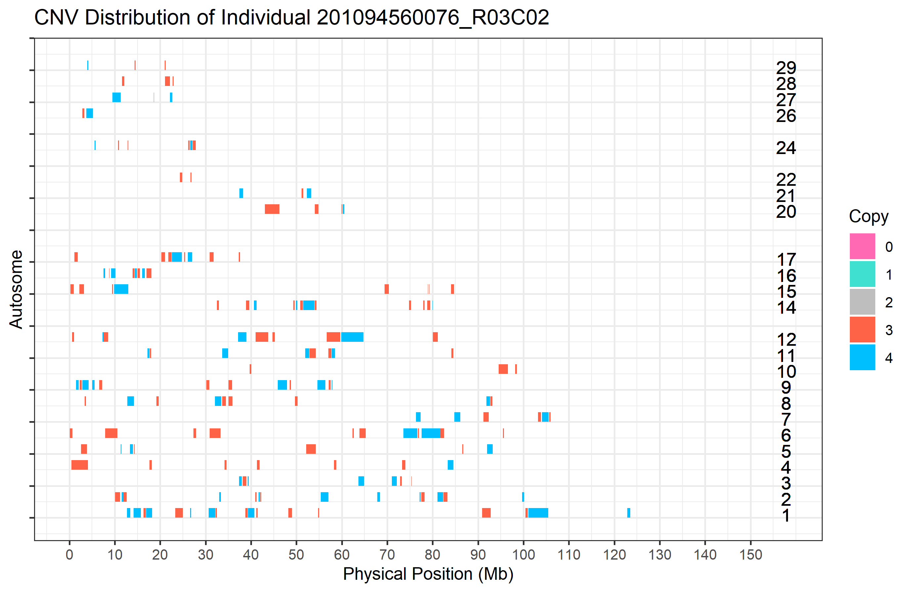
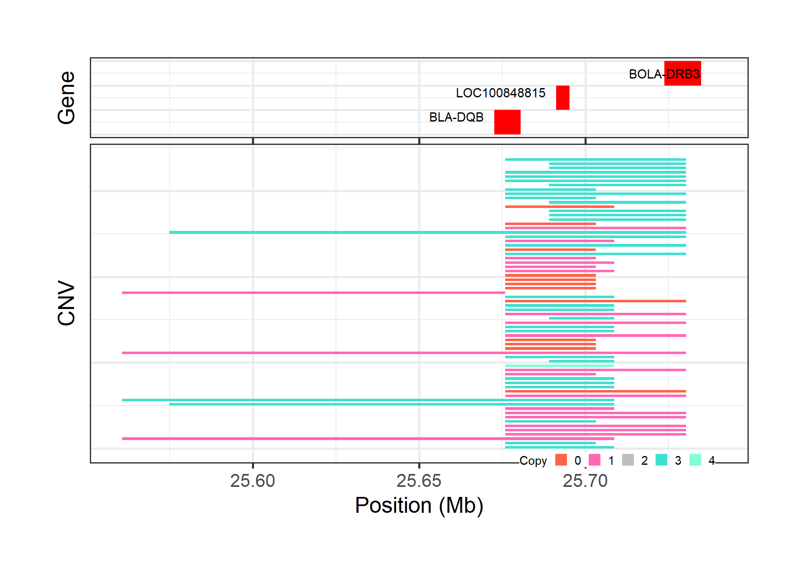
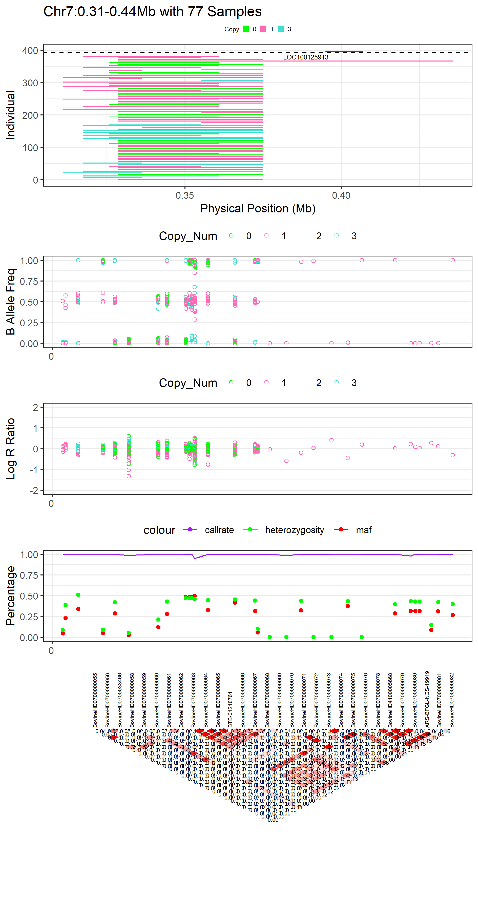

```{r, include = FALSE}
knitr::opts_chunk$set(
  collapse = TRUE,
  comment = "#>"
)
```

# Introduction
This package was originally designed for the Post-analysis of CNV results inferred from PennCNV and CNVPartition (GenomeStudio). However, it has now been expanded to accept input files in standard formats for a wider range of applications. Our motivation is to provide a standard, reproducible and time-saving pipeline for the post-analysis of CNVs and ROHs detected from SNP genotyping data for the majority of diploid Species. The functions provided in this package can be categorised into five sections: Conversion, Summary, Annotation, Comparison and Visualization. The most useful features provided are: integrating summarized results, generating lists of CNVR, annotating the results with known gene positions, plotting CNVR distribution maps, and producing customised visualisations of CNVs and ROHs with gene and other related information on one plot. This package also supports a range of customisations, including the colour, size of high resolution figures, and output folder, avoiding conflict between the results of different runs. Running through all functions detailed in the vignette could help us to identify and explore the most interesting genomic regions more easily. In the following sections, we will present how to use the functions provided in this package to solve these problems.

## Installation and Prerequisites
First, to run this package, we need to make sure that R (Version >= 3.5.2) is installed in your computer (R download link: https://www.r-project.org/). Once R is installed, the 'HandyCNV' package can be installed from Github repository by running the following script:
```{r}
#library(remotes)
#install_github(repo = "JH-Zhou/HandyCNV", auth_token = "3d2ac98e4c297bab332f1e68b3b2d49f3a17d6aa")
```
Then, we need to load the 'HandyCNV' package in order to run the following examples. This can be done using the `library` function as shown below.
```{r setup}
library(HandyCNV)
```

To start playing with this package, we first need to prepare at least one CNV result list. With only CNV results as an input file, we can explore the functions from section 1 to section 10 as below. But to get more interesting and potentially valuable results, we will have to prepare additional input files, including the map file and signal intensity file for the SNP chip used to generate the CNV list, the pedigree of the samples, and Plink format (bed, bim and fam) genotype files. Many of these files are already required during CNV discovery, and by generating them eaarly in the pipeline, you will find that the rest of workflow will be much easier and faster. We will be introducing how to prepare each of the input files in the relevant chunks below.

## Demo data
We have provided some internal demo data, which should installed with package, in order to demonstrate how to use this package. We can access the demo data using the built-in R function `system.file` (see examples below). In the demo data, the first CNV results file is the default output from PennCNV with the ARS-UCD 1.2 (ARS) cattle reference genome. The second CNV results file contains the default output from CNVPartition with UMD 3.1 (UMD) cattle reference genome, and the third CNV list is an example of a standard input file that could be prepared from CNV results inferred by other tools.<br>

Note: If you prefer not to test with this demo data, just skip this step to section 1 and use your own data instead.
```{r}
cnv_penn_ars <- system.file("extdata", "Demo_data/cnv_results/ARS_PennCNV_WGC.goodcnv", package = "HandyCNV")
cnv_part_umd <- system.file("extdata", "Demo_data/cnv_results/UMD_CNVPartition.txt", package = "HandyCNV")
cnv_other_umd <- system.file("extdata", "Demo_data/cnv_results/UMD_Standard_CNV.txt", package = "HandyCNV")
```

## Setting up a working directory
To start the analysis, let's first set up the working directory. This will help ensure that all results will be saved in the same directory.
```{r eval=FALSE}
setwd(dir = "C:/Users/handy_test") #remember to replace the path with your own 
```

# What issues can this package solve?
As above we mentioned, the functions in the package have been categorised into five sections: Conversion, Summary, Annotation, Comparison and Visualization.

Functions in the Conversion section can, for example, be used to convert coordinates between the default and target mapfiles provided by users; this would be useful if we are detecting CNVs with two different reference genomes. The converted map files can be output in formats suitable for use in Plink, PennCNV and our package 'HandyCNV'. It is also possible to convert coordinates for intervals (CNV, CNVR, QTL et al) between the defaults and target maps, which might useful when comparing the results to those of other researchers. Functions included in the Summarization section allow the formatting and plotting of outputs, such as producing detailed summaries of CNVs and ROHs, making CNV summary plots, generating CNV regions (CNVRs), and plotting CNVR distribution maps.

The Annotation section allows the downloading of reference gene lists from the UCSC website, enabling the annotation of CNV, CNVR, ROH or other intervals with gene locations. The Comparison section facilitates the comparison of CNVs, CNVRs, Gene Frequent Lists and any other intervals. The highlight of this section is that comparison of CNVs and CNVRs will produce reports detailing comparison results on both individual and population levels, and all comparison results are relative to both input files. Finally, the Visualization section contains functions to support customised CNV and ROH plotting by chromosome, specific sample, regions of interest, or target genes (plotting by gene is not yet available for ROH). It is also possible to annotate the plots with other information, such as gene locations, log R ratio, B Allele Frequency, SNP genotype, LD or the source of CNVs. These functions can also plot genes separately from reference gene lists, which might useful for comparing outputs with plots from other studies.

Now, let's start exploring the functions in `HandyCNV`.

## 1. How do we prepare the standard cnv input file for `HandyCNV` and get a quick summary?
We can use `cnv_clean` function to convert cnv results to standard format. This function will also produce a brief summary of CNV results. First, let's format the sample CNV results from PennCNV. Note:

a.  When formatting results in PennCNV format, the corresponding CNV input argument is 'penncnv'.
b.  Default PennCNV results in Sample ID columns usually have the file path ahead the Sample ID. For example with the file "/home/zjhang027/C/final_403_penncnv/201094560082_R03C01.txt", the pattern 'cnv/' before the sample ID is unique, so we can take it as the separator using the argument `penn_id_sep = "cnv/"` to extract the wanted sample ID.

```{r cnv_clean_penn, echo=TRUE, warning=FALSE}
cnv_clean(penncnv = cnv_penn_ars, #when running your own data, set this argument to 'penncnv = "localpath/file"'
          penn_id_sep = "cnv/", #take the unique pattern as a separator to extract the sample ID 
          drop_length = 5, # the maximum CNV length threshold (in Mb); CNVs larger than this value will be deleted
          folder = "cnv_clean") #create a new folder to save results 
```

Next, let's format a second set of CNV results, this time produced using CNVPartition. Note: The corresponding input argument is `cnvpartition` for CNV result from CNVPartition.
```{r cnv_clean_part, echo=TRUE, warning=FALSE}
cnv_clean(cnvpartition = cnv_part_umd, #when running your own data, set this argument by 'cnvpartition = "localpath/file"' 
          drop_length = 5, #the maximum CNV length threshold (in Mb); CNVs larger than this value will be deleted
          folder = "cnv_clean") 
```
If the CNV results were not produced by PennCNV or CNVPartition, we need to arrange the CNV results into the standard format, then use the `standard_cnv` argument instead. The standard CNV input list should include the following columns (in order):  `Sample_ID`, `Chr`, `Start`, `End` and `CNV_Value`.
```{r table1, message=FALSE, warning=FALSE, results='asis'}
tabl <- "
|Sample_ID           |Chr |Start   |End     |CNV_Value |
|--------------------|----|--------|--------|----------|
|201977910077_R05C01 |6   |9087392 |9250902 |1         |
|201094560084_R06C02 |7   |28583247|28621254|3         |
|201094560084_R06C02 |7   |37214745|37238472|1         |
|201094560067_R08C02 |4   |6248795 |6425277 |3         |
|201094560067_R08C02 |4   |66567442|66830563|3         |" 
```

Let's now run `cnv_clean` on the third Standard CNV input file. Note that we are using the argument `standard_cnv` for the third CNV result.
```{r}
cnv_clean(standard_cnv = cnv_other_umd, #when running your own data, set this argument by 'standard_cnv = "localpath/file"'
          drop_length = 5, #the maximum CNV length threshold (in Mb); CNVs larger than this value will be deleted
          folder = "cnv_clean")
```

## 2 How do we visualise CNVs?
The `cnv_visual` function supports visualising CNVs by chromosome, single sample, regions of interest, and target genes.

### 2.1 How do you have a quick overview of all CNVs on each chromosome?
Once we got the standard `clean_cnv` result, we can use the `cnv_visual` function to plot all CNVs, to have a quick look if there are any notable patterns in CNV results.

First, let's visualise the whole PennCNV dataset across all chromosomes:
```{r fig.show='hide', message=FALSE, warning=FALSE, echo=TRUE}
cnv_visual(clean_cnv = "cnv_clean/penncnv_clean.cnv", #standard file was generated by 'cnv_clean' function in section 1
           max_chr = 29, #select how many chromosomes to plot 
           width_1 = 20, #optional,adjust the width of final plot
           height_1 =12, #optional,adjust the height of final plot
           folder = "cnv_visual_all_penn")
```
{width=320px}

Let's now visualise CNVs from the CNVPartition results by chromosome. We can adjust the size of final figure by setting 'width_1' and 'height_1'.
```{r fig.show='hide', message=FALSE, warning=FALSE, echo=TRUE, results='hide'}
cnv_visual(clean_cnv = "cnv_clean/cnvpart_clean.cnv", #generated by 'cnv_clean' function in section 1
           max_chr = 29, #select how many Chromosomes to plot
           width_1 = 20, #optional,adjust the width of final plot
           height_1 = 12, #optional,adjust the height of final plot
           folder = "cnv_visual_all_part", )
```
{width=320px}

### 2.2 How do we plot CNVs in a region of interest?
After plotting all CNVs on each chromosome, we might find that some regions are particularly interesting. To plot these, we can add the options `chr_id`, `start_position` and `end_position` to the `cnv_visual` function call. Here, we are taking the region of Chr15:77-80.1221 Mb from the PennCNV results as an example.
```{r fig.show='hide', warning=FALSE}
cnv_visual(clean_cnv = "cnv_clean/penncnv_clean.cnv", #standard file was generated by 'cnv_clean' function in section 1
           chr_id = 15, #set Chromosome
           start_position = 77, #set start position, unit is 'Mb'
           end_position = 80.1221, #set end position, unit is 'Mb'
           col_0 = "red", #optional, customize colour for 0 copy CNVs 
           col_1 = "orange", #optional, customize colour for 1 copy CNVs 
           col_3 = "blue", #optional, customize colour for 3 copy CNVs 
           col_4 = "green", #optional, customize colour for 4 copy CNVs 
           width_1 = 13, #optional, adjust the width of final plot
           height_1 = 10, #optional, adjust the height of final plot
           folder = "cnv_visual")
```
{width=320px}

### 2.3 How do we plot CNVs in a sample of interest?
Here we need to assign both the Sample ID (to `individual_id`) and the clean CNV list (to `clean_cnv`) in the `cnv_visual` function. The individual CNV plot will saved in the current working directory. For example, the sample "201094560076_R03C02" has the most CNVs in the PennCNV results, so let's plot it and have a look. Note: we can use the `individual_cnv_count.txt` file (to be generated in section 3) to identify samples that exhibit large numbers of CNVs.
```{r fig.show='hide', warning=FALSE}
cnv_visual(clean_cnv = "cnv_clean/penncnv_clean.cnv", #standard file was generated by 'cnv_clean' function in section 1
           individual_id = "201094560076_R03C02", #set the sample ID  
           width_1 = 20, #optional, adjust the width of final plot
           height_1 = 13, #optional. adjust the height of final plot
           folder = "cnv_visual")
```
{width=320px}

### 2.4 How do we plot an interesting gene to see how many samples had a CNV overlapping with it?
The idea of plotting CNVs by target gene is to avoid making overly-strong statements when reporting important candidate genes after annotation for CNVRs. If we think that one particular gene is especially important in the CNV analysis, it's better to present the frequency at which that gene has a structural variation in the experimental population. Plotting CNVs by gene will directly present how many samples show copy number variations overlapping the gene. 

Note: The input file 'cnv_annotation.txt' will be generated in section 5.2, as part of annotating the gene to CNV results.
```{r fig.show='hide', warning=FALSE}
cnv_visual(clean_cnv = "call_gene_Penn_UCSC/cnv_annotation.txt", #here we need the annotated CNV list, generated by 'call_gene' in section 5.2
           target_gene = "BLA-DQB", #set the gene name we are interested in
           col_0 = "darkorchid4",  #optional, customize colour for o copy CNV 
           col_1 = "dodgerblue3",  #optional, customize colour for 1 copy CNV 
           col_3 = "violetred3",  #optional, customize colour for 3 copy CNV 
           col_4 = "orangered3",  #optional, customize colour for 4 copy CNV
           width_1 = 13, #adjust the width of final plot
           height_1 = 10, #adjust the width of final plot
           folder = "cnv_visual")
```
{width=320px}

### 2.5 How can we present annotated genes above the CNV plot?
To do this, we need to provide two input files to the `cnv_visual` function: the CNV list in `clean_cnv` and gene annotations in `refgene`. We should also set the genomic region we are interested in. The reference gene list will be generated by the `get_refgene` function in section 5.
```{r, fig.show='hide'}
cnv_visual(clean_cnv = "cnv_clean/penncnv_clean.cnv", #standard file was generated by 'cnv_clean' function in section 1
           refgene = "refgene/cow_ARS_UCSC.txt", #standard input file will generated by the function 'get_refgene' in Section 5
           chr_id = 23, #set Chromosome
           start_position = 25.56, #set start position, unit is 'Mb'
           end_position = 25.74, #set end position, unit is 'Mb'
           gene_font_size = 2.2, #optional, adjust the size of gene font
           show_name = c(25.66,27.72), #optional, show the gene in the given interval, maximum support two intervals
           col_0 = "tomato", #optional, customize colour for 0 copy CNV 
           col_1 = "hotpink", #optional, customize colour for 1 copy CNV 
           col_3 = "turquoise", #optional, customize colour for 3 copy CNV 
           col_4 = "aquamarine", #optional, customize colour for 4 copy CNV 
           col_gene = "red", #optional, customize colour of gene  
           width_1 = 14, #optional, adjust the width of final plot
           height_1 = 10, #optional, adjust the height of final plot
           folder = "cnv_visual")
```
{width=320px}

## 3. What types of summary plots are available?
Using the clean CNV results, we can run the `cnv_summary_plot` function to generate a range of summary plots. These plots can aggregate CNV results by length group, CNV type, chromosome, and individual. It is also possible to make two different types of plots combining these figures.

```{r cnv_summary_plot_penn, fig.show='hide', warning=FALSE}
cnv_summary_plot(clean_cnv = "cnv_clean/cnvpart_clean.cnv", #standard file was generated by 'cnv_clean' function in section 1
                 length_group = c(0.05, 0.1, 0.2, 0.3, 0.4, 0.5, 0.6, 0.7, 1, 2, 5), # optional, set group of vectors to divide CNV length, unit is Mb. such as vector of ‘c(0.05, 0.3, 1)’, means divide the CNV length into four group: '<0.05Mb', '0.05 - 0.3Mb', '0.3-1Mb' and '>1Mb', maximum can accept 11 values
                 col_0 = "red", #optional, customize color for o copy CNV 
                 col_1 = "black", #optional, customize color for o copy CNV 
                 col_3 = "purple", #optional, customize color for o copy CNV 
                 col_4 = "blue", #optional, customize color for o copy CNV 
                 plot_sum_1 = TRUE,  #optional, make sum combination plot 1
                 height_sum1 = 26, #optional, adjust the size of sum plot 1
                 width_sum1 = 20, #optional, adjust the size of sum plot 1
                 plot_sum_2 = TRUE, #optional, make sum combination plot 2
                 height_sum2 = 20, #optional, adjust the size of sum plot 2
                 width_sum2 = 27, #optional, adjust the size of sum plot 2
                 folder = "cnv_summary_plot_penn")
```
{width=320px}

{width=320px}

## 4. How do we generate CNVRs (CNV Regions) from CNV results?
CNV regions are defined as regions of the genome containing one or more CNVs that overlap by at least one base pair: s a result, CNVRs will never overlap one another. As an example, let's first generate CNVRs for the clean PennCNV results, using the `call_cnvr` function. A key parameter of this function is `chr_set`, which allows setting the maximum number of chromosomes over which to generate CNVRs. In our example, the species is *Bos taurus* (cows), with 29 autosomes, so we set `chr_set = 29`. This function will output three tables:

1.  The list of CNVRs. This is saved into the file `individual_cnv_cnvr.txt`.
2.  A brief summary table showing numbers of CNVRs by length and type (Deletion, Duplication, and Mixed). Mixed indicates that both duplications and deletions are found within the CNVR.
3.  The total length and number of CNVRs on each chromosome.

The resulting CNVRs are sorted by chromosome, start position, and end position, then assigned the CNVR ID to each unique interval by order. One of the output files, `individual_cnv_cnvr.txt` contain both CNVR and CNV information for every sample: this file might suitable for CNV-GWAS analyses.
```{r echo=TRUE, warning=FALSE}
call_cnvr(clean_cnv = "cnv_clean/penncnv_clean.cnv", #standard file was generated by 'cnv_clean' function in section 1
          chr_set = 29, #Set the maximum number of chromosomes (29 autosomes for cattle)
          folder = "call_cnvr_penn")
```

Next, let's generate CNVRs for CNVPartition and standard CNV lists. In order to avoid mixing the results among different files, we can set the `folder` argument to assign a distinguishing name to the newly generated folder. 
```{r warning=FALSE, echo=TRUE, results='hide'}
call_cnvr(clean_cnv = "cnv_clean/cnvpart_clean.cnv", #standard file was generated by 'cnv_clean' function in section 1
          chr_set = '29', 
          folder = "call_cnvr_part")

call_cnvr(clean_cnv = "cnv_clean/cleancnv.cnv", #standard file was generated by 'cnv_clean' function in section 1
          chr_set = 29,
          folder = "call_cnvr_standard")

```

## 5. How do we annotate genes for CNVRs and CNVs?
Once we have defined some CNV regions, we might want to see how many genes are located each. We can annotate genes to both CNVs and CNVRs using the `call_gene` function. Before that, however, we need to prepare gene lists for the correct reference genome. This can be done using the `get_refgene` function, as described in the following sections.

### 5.1 How do we download the reference gene lists we need?
We can use the `get_refgene` function to automatically download the reference gene list and convert it to the standard format required for functions such as `call_gene`. First, let's run `get_refgene` without arguments to see which reference gene lists we can download. If you don't find the information you're looking for, please feel free to contact our maintainer to update it to you. For now, only reference gene lists from the UCSC website are supported; however, we may add more features if there is sufficient demand.
```{r}
get_refgene()
```

Now, let's get the reference gene list for the PennCNV results. This dataset was generated using ARS-UCD 1.2 as reference genome. Two gene lists are available for this reference: `cow_ARS_UCSC` and `cow_ARS_ENS`. The suffix `ENS` indicates the Ensembl reference gene list. The gene list will be saved in the folder `refgene`, which will be created first if necessary.
```{r}
get_refgene(gene_version = "Cow_ARS_UCSC")
get_refgene(gene_version = "Cow_ARS_ENS")
```

Next let's get reference gene list for the CNVPartition and Standard result sets, both of which were generated on the UMD 3.1 reference genome; in this case, `Cow_UMD_UCSC` is the correct option to select.
```{r}
get_refgene(gene_version = "Cow_UMD_UCSC")
```

Now we have well-prepared reference gene lists, let's return to the `call_gene` function.

### 5.2 The `call_gene` function
The `call_gene` function has three arguments:

1.  `ref_gene`: this argument is required, and takes the path of a downloaded gene set (in the `refgene` folder).
2.  `interval`: an optional file containing a list of CNV regions. This argument can also point to any file storing interval data in the correct format; examples could include CRVs, QTL windows, or haplotype lists.
3.  `clean_cnv`: an optional file containing a list of CNVs

We suggest that both 'interval' and 'clean_cnv' should be set simultaneously: this will enable reporting of the frequency of all annotated genes by counting how many CNVs overlapped to each gene within a CNVR. In section 10, we will show how to use the output file `gene_freq_cnv.txt` to make comparisons between different CNV results to find sets of consensus genes.

As an example, we will first call genes for the PennCNV results, ensuring that the gene list for the correct reference has been set (ARS 1.2). In this case, we are using the Ensembl-provided gene list.
```{r}
call_gene(refgene = "refgene/cow_ARS_ENS.txt", #standard file was generated by 'get_refgene' function in section 5.1
          interval = "call_cnvr_Penn/cnvr.txt", #optional, standard file was generated by 'call_cnvr' function in section 4
          clean_cnv = "cnv_clean/penncnv_clean.cnv", #optional, standard file was generated by 'cnv_clean' function in section 1
          folder = "call_gene_Penn_Ens")
```

We can also use the UCSC gene list: 
```{r message=FALSE, echo=TRUE, results='hide'}
call_gene(refgene = "refgene/cow_ARS_UCSC.txt", #standard file was generated by 'get_refgene' function in section 5.1
          interval = "call_cnvr_Penn/cnvr.txt", #standard file was generated by 'call_cnvr' function in section 4
          clean_cnv = "cnv_clean/penncnv_clean.cnv", #optional, standard file was generated by 'cnv_clean' function in section 1
          folder = "call_gene_Penn_UCSC")
```

Comparing the results, we observe that the results from two reference gene lists are slightly different, likely because the maintainers of each database have different methodologies (and possibly data sources) for producing their gene annotations. As a result of this, the position and quantity of genes might slightly differ between gene builds even for the same reference genome. Therefore, it may be important to validate genes of interest in more than one database.

Now, let's call genes for the CNVPartition results. As before, we provide both CNVR and CNV lists, and set the new folder name by arguments. Note that we need to use the UMD 3.1 reference build for this data set. We also run the standard CNV set (using the ARS1.2 reference).
```{r message=FALSE, echo=TRUE, results='hide'}
call_gene(refgene = "refgene/cow_UMD_UCSC.txt", #standard file was generated by 'get_refgene' function in section 5.1
          interval = "call_cnvr_Part/cnvr.txt", #standard file was generated by 'call_cnvr' function in section 4
          clean_cnv = "cnv_clean/cnvpart_clean.cnv", #optional, standard file was generated by 'cnv_clean' function in section 1
          folder = "call_gene_Part")

call_gene(refgene = "refgene/cow_ARS_UCSC.txt", #standard file was generated by 'get_refgene' function in section 5.1
          interval = "call_cnvr_standard/cnvr.txt", #standard file was generated by 'call_cnvr' function in section 4
          clean_cnv = "cnv_clean/cleancnv.cnv", #optional, standard file was generated by 'cnv_clean' function in section 1
          folder = "call_gene_standard_ARS_UCSC")
```

## 6. How to plot CNVR distribution map?
The function `cnvr_plot` is used to plot the CNVR distribution across chromosomes. For this function, we only need to assign the a CNVR list file to the `cnvr` argument, and the reference genome assembly to the `assembly` argument (to provide chromosome lengths). For Bovine data, we provide data for both ARS and UMD. For other species with data available (see the `ref_gene` function in section 5.1), we can just assign the species name to the `assembly` argument, for example, `assembly = "human"` for human data.

First, we'll plot the CNVR distribution for the PennCNV data set. The default legend position might not suitable for all species; the arguments `legend_x` and `legend_y` can be used to move it if necessary.
```{r, fig.show='hide'}
cnvr_plot(cnvr = "call_cnvr_Penn/cnvr.txt", #standard file was generated by 'call_cnvr' function in section 4
          assembly = "ARS", #cattle could select 'UMD' or 'ARS', other species could assign the name of species
          loss_col = "green2", #optional, adjust the color of Loss type of CNVR
          gain_col = "red", #optional, adjust the color of Gain type of CNVR
          mixed_col = "black",  #optional, adjust the color of Mixed type of CNVR
          legend_x = 127, #optional, adjust the horizontal position of legend
          legend_y = 30,  #optional, adjust the vertical position of legend
          height_1 = 14, #optional, adjust the height of CNVR plot
          width_1 = 10, #optional, adjust the width of CNVR plot
          folder = "cnvr_plot_penn")
```
{width=320px}

Next, we plot the CNVRs derived from the CNVPartition data set.
```{r, fig.show='hide'}
cnvr_plot(cnvr = "call_cnvr_Part/cnvr.txt", #standard file was generated by 'call_cnvr' function in section 4
          assembly = "UMD", #cattle could select 'UMD' or 'ARS', other species could assign the name of species
          loss_col = "darkorchid", #optional, adjust the color of Loss type of CNVR
          gain_col = "gold", #optional, adjust the color of Gain type of CNVR
          mixed_col = "tomato",  #optional, adjust the color of Mixed type of CNVR
          legend_x = 127, #optional, adjust the horizontal position of legend
          legend_y = 30,  #optional, adjust the vertical position of legend
          height_1 = 14, #optional, adjust the height of CNVR plot
          width_1 = 10, #optional, adjust the width of CNVR plot
          folder = "cnvr_plot_part")
```
{width=320px}

## 7. How can we plot all high frequency CNVRs at once?
It always interesting to see which genomic regions have the highest frequencies of structure variation. To view these, we can plot all the high frequency regions using the `cnvr_plot` function.

As an example, let's plot the PennCNV results. Remember to set a new folder name to save the results.
```{r fig.show='hide', warning=FALSE, message=FALSE, echo=TRUE, results='hide'}
cnvr_plot(cnvr = "call_cnvr_Penn/cnvr.txt", #standard file was generated by 'call_cnvr' function in section 4
          clean_cnv = "cnv_clean/penncnv_clean.cnv", #standard file was generated by 'cnv_clean' function in section 1
          refgene = "refgene/cow_ARS_ENS.txt", #standard file was generated by 'get_refgene' function in section 5.1
          sample_size = 382, #total sample size
          common_cnv_threshold = 0.18, #the CNV frequency threshold
          width_1 = 10, #optional, adjust the width of final plot
          height_1 = 10, #optional, adjust the height of final plot
          col_gene = "blue", #optional, adjust the colour of annotated genes
          gene_font_size = 2.5, #optional, adjust the font size of annotated gene names
          folder = "high_freq_cnvr_penn")
```
{width=320px}


## 8. Can we compare CNVs between different result sets?
Typically, we will use multiple models and software packages when predicting and analysing CNVs, especially when using data based on SNP chip genotypes. As a result, it is very common that we will need to compare two or more sets of predicted CNVs. To tackle this problem, we have implemented the `compare_cnv` function to make comparisons on both the individual and population levels. At the individual level, the function checks how many CNVs overlap in the same individual between two CNV result sets, thereby verifying the level of similarity between the two sets of results. On the population level, the comparison will check the level of overlap through the whole sample population, without checking whether or not the CNVs are present in the same individual; this can better indiciate the degree of repeatability of CNV detection between the two result sets.

As an example let's compare the CNV prediction results for PennCNV and CNVPartition. Note that these results were generated using different reference builds, so the results of the comparison are currently rather meaningless (the physical coordinates of the CNVs will not line up across reference builds): this problem will be fixed in section 11 below.

```{r, fig.show='hide'}
compare_cnv(cnv_def = "cnv_clean/cleancnv.cnv", #standard file was generated by 'cnv_clean' function in section 1
            cnv_tar = "cnv_clean/penncnv_clean.cnv", #standard file was generated by 'cnv_clean' function in section 1
            width_1 = 12, #optional, adjust the width of final plot
            height_1 = 11, #optional, adjust the height of final plot
            legend_x = 0.9, #optional, adjust the horizontal position of final plot
            legend_y = 0.9, #optional, adjust the vertical position of final plot
            col_1 = "pink", #optional, adjust the colour of Non-Overlapped part
            col_2 = "lightblue", #optional, adjust the colour of Overlapped part
            plot_caption = TRUE, #optional, show the Note information in plot or not
            folder = "compare_cnv_PartUMD_Vs_PennUMD")
```
{width=330px}

## 9. What about CNVRs?
Similar to the `compare_cnv` function, we can use the `compare_cnvr` function to compare CNV regions. The same caveats apply with regard to the ensuring the two CNVR data sets were built on the same reference genome. Let's try to use `compare_cnvr` now with the CNVPartition and Standard data sets (as before, ignoring for now the fact that these were produced on different reference genomes).

```{r, fig.show='hide'}
compare_cnvr(cnvr_def  = "call_cnvr_Part/cnvr.txt", #standard file was generated by 'call_cnvr' function in section 4
             cnvr_tar  = "call_cnvr_standard/cnvr.txt", #standard file was generated by 'call_cnvr' function in section 4
             width_1 = 8, #optional, adjust the width of comparison plot
             height_1 = 8, #optional, adjust the height of comparison plot
             hjust_prop = 0.2, #optional, adjust the horizontal position of the proportion number present in plot
             hjust_num = 1.6, #optional, adjust the horizontal position of the number present in plot
             col_1 = "grey15", #optional, adjust the colour of non-overlapped part
             col_2 = "forestgreen", #optional, adjust the colour of overlapped part
             folder = "compare_cnvr_PartUMD_Penn_UMD")
```
{width=320px}

## 10. How do we find the consensus set of genes common to multiple CNV result sets?
One of the most interesting parts of CNV analysis is to find out which genes are affected by structure variations, and to check out the frequency of these aberrant genes in our samples. After using the `call_gene` function in section 5.2, we now have the gene frequency list for each CNV result set. We can take these lists as input in the `compare_gene` function to find the set of consensus genes common to multiple CNV results.

Now, let's compare the annotated gene lists for the PennCNV and CNVPartition results as an example. We can assign the arguments `gene_freq_1` and `gene_freq_2` with the `gene_freq_cnv.txt` files from the `call_gene_Part` and `call_gene_Penn` output folders created earlier. Then we need to set an integer threshold (`common_gene_threshold`) for the number of observations required to declare that a gene is "commom". In our example, the sample size is 400, so for a prevalence of 5%, the `common_gene_threshold` could calculated as `400 * 5% = 20`. 
```{r, fig.show='hide'}
compare_gene(gene_freq_1 = "call_gene_Part/gene_freq_cnv.txt", #standard file was generated by 'call_gene' function in Section 5.2
             gene_freq_2 = "call_gene_Penn_Ens/gene_freq_cnv.txt", #standard file was generated by 'call_gene' function in Section 5.2
             title_1 = "Bovine Part", #optional, adjust the title of input file 1 present in final plot 
             title_2 = "Bovine Penn", #optional, adjust the title of input file 2 present in final plot 
             common_gene_threshold = 20, #optional, the threshold is the gene frequency, here 20 means the Gene frequency exceed 20 in two input lists will be regarded as common gene. 
             col_1 = "red", #optional, set the colour of 'Common High' genes
             col_2 = "blue", #optional, set the colour of 'Common Low' genes
             col_3 = "gold", #optional, set the colour of 'gene_freq_1'-only genes
             col_4 = "green", #optional, set the colour of 'gene_freq_2'-only genes
             height_1 = 10, #optional, adjust the height of final plot
             width_1 =  12, #optional, adjust the width of final 
             folder = "compare_gene_Part_Vs_Penn")
```
{width=300px}

We can also compare the frequency lists for three genes, just by adding one more input file (using the `gene_freq_3` argument); in this case, the comparison figure will be a 3D plot.
```{r, fig.show='hide'}
compare_gene(gene_freq_1 = "call_gene_Part/gene_freq_cnv.txt", #standard file was generated by 'call_gene' function in Section 5.2
             gene_freq_2 = "call_gene_Penn_Ens/gene_freq_cnv.txt", #standard file was generated by 'call_gene' function in Section 5.2
             gene_freq_3 = "call_gene_standard_ARS_UCSC/gene_freq_cnv.txt", #standard file was generated by 'call_gene' function in Section 5.2
             title_1 = "Part", #optional, adjust the title of input file 1 present in final plot 
             title_2 = "ENS", #optional, adjust the title of input file 2 present in final plot 
             title_3 = "UCSC", #optional, adjust the title of input file 3 present in final plot 
             common_gene_threshold = 15,
             height_1 = 5.8, #optional, adjust the height of final plot
             width_1 = 5.8, #optional, adjust the width of final plot
             folder = "compare_gene_three_lists")
```
{width=320px}

If we add a fourth gene frequency lists, by adding the `gene_freq_4` argument, the comparison figure produced will be a heat-map rather than a scatterplot.
```{r, fig.show='hide'}
compare_gene(gene_freq_1 = "call_gene_Part/gene_freq_cnv.txt", #standard file was generated by 'call_gene' function in Section 5.2
             gene_freq_2 = "call_gene_Penn_UCSC/gene_freq_cnv.txt", #standard file was generated by 'call_gene' function in Section 5.2
             gene_freq_3 = "call_gene_Part/gene_freq_cnv.txt", #standard file was generated by 'call_gene' function in Section 5.2
             gene_freq_4 = "call_gene_standard_ARS_UCSC/gene_freq_cnv.txt", #standard file was generated by 'call_gene' function in Section 5.2
             title_1 = "Part", #optional, adjust the title of input file 1 present in final plot 
             title_2 = "ENS", #optional, adjust the title of input file 2 present in final plot 
             title_3 = "UCSC", #optional, adjust the title of input file 3 present in final plot 
             title_4 = "PUCSC", #optional, adjust the title of input file 4 present in final plot 
             col_1 = "red", #optional, set the color of High frequency genes
             col_2 = "yellow", #optional, set the color of Low frequency genes
             common_gene_threshold = 20,
             height_1 = 9, #optional, adjust the height of final plot
             width_1 = 11, #optional, adjust the width of final plot
             folder = "compare_gene_four_lists")
```
{width=300}

# Brief summary
The ten functions we've run so far only require users to provide the CNV results, which can already generate plenty of summary results that include sufficient information to point us in the right direction to dig deeper. If we want to explore a particular region in more depth, there are extra functions in the `HandyCNV` package that can combine CNV data with other data sources. We will introduce some of these functions in the following section.


## 11. How can we create the map file used in `HandyCNV`, to allow comparing CNVs between different reference genomes?
We can use the `convert_map` function to prepare a map file; generally, we will need one for each reference file. In our examples, we have used the two bovine reference genomes ARS-UCD 1.2 and UMD 3.1. For `HandyCNV`, map files hould have the format shown in the table below, with the four columns `Chromosome`, `SNP`, `MorganPos`， and `PhysicalPos`. If the centiMorgan position (`MorganPos`) is unknown, we can assign the missing value as `0`, or provide the phyisical position in megabases. This format is the same as the standard `.map` format used in Plink and other software, and can be exported from GenomeStudio. The column names are not required.

```{r table2, echo=TRUE, message=FALSE, warning=FALSE, results='asis'}
tabl <- "
-----------------------------------------
Chr   SNP           MorganPos PhysicalPos
---- ------------- ---------- -----------               
  5	  14636        	56.3275   56327514 
  5	  16084        	56.329	  56328962  
  5	  19597        	56.3325	  56332475  
  1	  1_115292065  	114.371	  114370731  
  1	  1_115292107  	114.371	  114370773 
-----------------------------------------"
```

Here, we have the map files for both bovine references included in the package, at the following paths:
```{r}
ars_map <- system.file("extdata", "Demo_data/map/ARS1.2_GGPHDV3.map", package = "HandyCNV")
umd_map <- system.file("extdata", "Demo_data/map/UMD3.1_Bovine.map", package = "HandyCNV")
```
The function will not only generate map files, for use in `compare_cnv` and `compare_cnvr`, it will also generate map file used in Plink and PennCNV for both inputs. The conversion process also compares the two input maps and produces summary tables and figures.

```{r fig.show='hide', warning=FALSE}
convert_map(default_map = umd_map, #when running your own data, set this argument to 'default_map = "localpath/file"'
            target_map = ars_map, #when running your own data, set this argument to 'target_map = "localpath/file"'
            defMap_title = "UMD 3.1", #set the label of axis
            tarMap_title = "ARS-UCD 1.2", #set the label of axis
            col_1 = "green4", #set colour for the type of Match in SNP comparison plot
            col_2 = "red", #set colour for the type of Unmatched in SNP comparison plot
            col_3 = "deeppink2", #set colour for the bar of Target_Map in SNP density plot
            col_4 = "deeppink2", #set colour for line of Target_map in density plot
            col_5 = "turquoise3", #set colour for point of Default_Map in SNP density plot
            col_6 = "turquoise3", #set colour for line of Default_map in SNP density plot
            species = "Bovine")
```
{width=320px}

{width=320px}

## 12. How can we integrate the CNVs and annotated genes with additional information, such as Log R ratio, B Allele Frequency, call rate, heterozygosity, missing value rate and Linkage Disequilibrium, and plot it as one figure?

The `plot_cnvr_panorama` function was built to achieve this task. But we need provide more information to this function:
a.  CNVR results(generated by 'call_cnvr' in section 4)
b.  Annotated CNV file (generated by 'call_gene' function)
c.  Signal Intensity file (In general it export from GenomeStudio which used in CNV detection process)
d.  Map file (Four columns used in Plink or generated by 'convert_map' function)
e.  Genotype files (generated by Plink with '--make-bed' flag which include BED, BIM, FAM three files)

{r fig.show='hide', warning=FALSE, message=FALSE}
plot_cnvr_panorama(cnvr = "call_cnvr_Penn/cnvr.txt", #standard file was generated by 'call_cnvr' function in section 4
                   cnv_annotation = "call_gene_Penn_UCSC/cnv_annotation.txt", #standard file was generated by 'call_gene' function in Section 5.2
                   intensity = "Demo_data/demo_intensity.txt", 
                   map = "Demo_data/demo.map", 
                   prefix_bed = "Demo_data/demo_HandyCNV", 
                   ld_heat = TRUE,
                   sample_size = 382, 
                   common_cnv_threshold = 0.18, 
                   col_0 = "green", #optional, customize color for o copy CNV 
                   col_1 = "hotpink", #optional, customize color for 1 copy CNV 
                   col_2 = "gray", #optional, customize color for 2 copy CNV 
                   col_3 = "turquoise", #optional, customize color for 3 copy CNV 
                   col_4 = "aquamarine", #optional, customize color for 4 copy CNV 
                   col_gene = "red", #optional, customize color of gene 
                   width_1 = 16,
                   height_1 = 30,
                   folder = "cnvr_panorama_heat_ld")

{width=150px}

For LD, we can replace the heatmap with the classic inverted triangle diagram by setting the argument `ld_heat = FALSE`, which will use the `gaston` package to plot LD. Because this requires converting the figure to `ggplot` format (via the `ggplotify` package), this process can be time consuming, and sometimes does not work well for large genomic regions. Therefore, we suggest that you use `ld_heat = TRUE` initially, before narrowing in on a particular region  of interest to display with the classic LD plot.
```{r eval=FALSE, warning=FALSE, include=FALSE, results='hide'}
plot_cnvr_panorama(cnvr = "call_cnvr_Penn/cnvr.txt", #standard file was generated by 'call_cnvr' function in section 4
                   cnv_annotation = "call_gene_Penn_UCSC/cnv_annotation.txt", #standard file was generated by 'call_gene' function in Section 5.2
                   intensity = "Demo_data/demo_intensity.txt", 
                   map = "Demo_data/demo.map", 
                   prefix_bed = "Demo_data/demo_HandyCNV", 
                   sample_size = 382, 
                   common_cnv_threshold = 0.18,
                   ld_heat = FALSE,
                   col_0 = "green", #optional, customize colour for o copy CNV 
                   col_1 = "hotpink", #optional, customize colour for 1 copy CNV 
                   col_2 = "gray", #optional, customize colour for 2 copy CNV 
                   col_3 = "turquoise", #optional, customize colour for 3 copy CNV 
                   col_4 = "aquamarine", #optional, customize colour for 4 copy CNV 
                   col_gene = "red", #optional, customize colour of gene  
                   width_1 = 16,
                   height_1 = 30,
                   folder = "cnvr_panorama_classical_ld")
```
{width=150px}
     
## 13. How can we make a plot to show the source of the CNVs? 
CNVs are heritable: with the pedigree information, particularly for the sires in a livestock context, we can produce plots of CNV sources. The `plot_cnvr_source` function can produce plots by sire, herd, and sire source. Sire source can be any freeform text, for example the country of origin. The expected input format is comma-separated (with a header), containing the following columns (in any order):

*  `Chip_ID` (matched to the `Sample_ID` column in the CNVR data)
*  `Herd`
*  `Sire_ID`
*  `Sire_Source`

```{r warning=FALSE, message=FALSE, echo=TRUE, results='hide'}
plot_cnvr_source(cnvr = "call_cnvr_Penn/cnvr.txt", #standard file was generated by 'call_cnvr' function in section 4
                clean_cnv = "cnv_clean/penncnv_clean.cnv", #standard file was generated by 'cnv_clean' function in section 1
                pedigree = system.file("extdata", "Demo_data/Pedigree/Pedigree.csv", package = "HandyCNV"), 
                Frequent_threshold = 80,
                height_1 = 20, 
                width_1 = 15)
```
{width=150px}

## 14. How can we plot just the genes in a specific region, to save as a seperate figure?
The `plot_gene` function can do this for a specific reference gene set and genomic region.
```{r, fig.show='hide'}
plot_gene(refgene = "refgene/cow_ARS_UCSC.txt", 
          chr_id = 7, 
          start = 11, 
          end = 12, 
          height_1 = 3, 
          width_1 = 10, 
          show_name = c(11.0, 11.35, 11.75, 12.00), 
          gene_font_size = 2.5)
```
{width=300px}

## 15. How can we find regions with high frequencies of runs of homozygosity?
An ROH (Run of homozygosity) is a region of an individual's genome where almost all variants have homozygous genotypes. These regions generally indicate the presence of inbreeding in that individual's ancestry, with more recent inbreeding leading to longer ROHs.

The function `roh_window` will produce two summary tables, as well as plotting the high frequency regions by chromosome. The first table summarises the total numbers and lengths of ROHs for each individual; the second reports summary statistics for aggregated windows of ROHs across all individuals.
```{r}
roh_window(roh = "cnv_clean/cnvpart_roh.cnv", 
           window_size = 2,
           length_autosomal = 2489.386, 
           threshold = 0.15, 
           folder = "roh_window", 
           col_higher = "red", 
           col_lower = "black", 
           height_1 = 15, 
           width_1 = 11, 
           legend_x = 0.92, 
           legend_y = 0.06,
           ncol_1 = 5)
```
{width=300px}

## 16. How do we visualise ROHs?
Visualising ROH is similar to visualising CNVs. The exception is that, because length is particularly informative for ROHs (about the age of inbreeding), the ROHs are coloured by their lengths. The `roh_visual` function can plot ROHs, either across the whole genome, or chromosome by chromosome. It also supports restricting plotting to regions of interest, and allows adding a panel of gene locations.

To plot a single chromosome, use the `chr_id` argument.
```{r warning=FALSE}
roh_visual(clean_roh = "cnv_clean/cnvpart_roh.cnv", 
           chr_id = 6, 
           width_1 = 14, 
           height_1 = 9, 
           folder = "roh_visual", 
           col_short = "red", 
           col_mid = "blue", 
           col_long = "black")
```
{width=300px}

To plot a single region of interest, add the `start_position` and `end_position` arguments (units in megabases).
```{r}
roh_visual(clean_roh = "cnv_clean/cnvpart_roh.cnv", 
           chr_id = 6, 
           start_position = 36.5, 
           end_position = 40.6, 
           width_1 = 16)
```
{width=300px}


To add a panel of gene locations, add the `refgene` argument, pointing to a file containing genes annotated on the appropriate reference genome.
```{r, fig.show='hide', results='hide'}
roh_visual(clean_roh = "cnv_clean/cnvpart_roh.cnv", 
           chr_id = 6, 
           start_position = 36.5, 
           end_position = 40.61, 
           refgene = "refgene/cow_UMD_UCSC.txt")
```
{width=300px}


If the ROH region has too much genes, plotting all the gene names will make the figure look too busy. We can choose the most important region(s) to plot using the `show_names` argument. In this example, we set two regions with the following argument: `show_name = c(37.28, 37.49, 38.25, 39.52)`. This will show the gene names in two regions:  (37.28 - 37.49 Mb) and (38.25 - 39.52 Mb).
```{r fig.show='hide', warning=FALSE, results='hide'}
roh_visual(clean_roh = "cnv_clean/cnvpart_roh.cnv", 
           chr_id = 6, 
           start_position = 36.5, 
           end_position = 40.5, 
           refgene = "refgene/cow_UMD_UCSC.txt", 
           show_name = c(37.28, 37.49, 38.25, 39.52), col_short = "black", col_mid = "green", col_long = "red")
```
{width=300px}

## 17. How do we convert coordinates for CNV, CNVR, ROH, or any other Intervals?
The function 'convert_coord' can use to convert coordinates for Intervals lists, but now the usage are limited on the 'def_tar_map' file which generated by 'convert_map' function at the moment, and only working for converting the coordinates for the Intervals which from the same type of SNP Chips. Convert coordinates might change the total length of the interval, because of the Order of SNPs on the Chromosome might differ between various versions of reference genome, here we should pay attention to check the quality of Conversion, then use it with caution.<br>
2. Add 'proxy_range' argument to support to adjust the range of area to search and assign the 'proxy location' for the markers which are missing in the target map. The purpose is to try the best reduce the lost of Intervals after conversion.  The principal is try to reduce the length of interval which were assigned proxy location. For the start position, the searching range start from the missing position toward to down steam, then extract the minimum value as proxy position. For end position, the searching range start from missing location toward to the up steam, then assign the largest value as proxy position, If the searching region are no any point exist, will assign the "Missing" instead. 3. Add argument 'len_diff_threshold' to make quality control on the new converted Intervals by check the difference of length between conversion and original Intervals. Only the new conversion smaller than the threshold will label as 'Pass'. 4. Add summary table to summarize how many Intervals are succeed conversion, what the difference of length between converted Intervals and original Intervals.  
Here, we try to convert the Part CNVR results from UMD coordinate to ARS1.2 version, let's see what the quality are and how should we use it. 
{r}
convert_coord(input_def = "cnv_clean/cleancnv.cnv", 
              def_tar_map = "convert_map/def_tar_map.map",
              proxy_range = 100000,
              len_diff_threshold = 100000,
              folder = "convert_coord_penn_cnv")

We can also convert coordinates from target map to default map, let's try to convert the Penn ARS results to Penn UMD results. After convert coordinates of CNV and CNVR, we could use the results which passed the quality check to make comparison by 'compare_cnv' and 'compare_cnvr' as section 8 and 9 described.
{r}
convert_coord(input_def = "call_cnvr_standard/cnvr.txt", 
              proxy_range = 100000,
              len_diff_threshold = 100000,
              def_tar_map = "convert_map/def_tar_map.map", 
              folder = "convert_coord_penn_cnvR")


